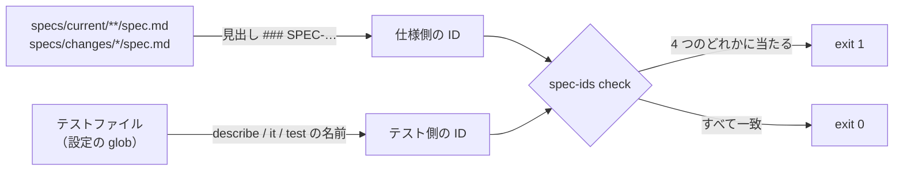

# spec-ids

仕様書の見出しに付けた仕様 ID と、テスト名に付けた仕様 ID を突き合わせて、食い違いがあれば CI で止めるための CLI です。仕様 ID の採番と、仕様の置き場（`specs/`）の初期化も行います。

自律的にコードを書くエージェント（Claude Code など）が仕様を黙って書き換えないように、「仕様の正本」「受入テスト」「実装」を同じ ID で結び、ずれたら機械で止める、という運用の道具です。運用の手順そのもの（誰が何を書いてよいか、承認の流れ）はこのパッケージには入っていません。各リポジトリの `AGENTS.md` に書きます。

## 何をするか



`spec-ids check` は次の 4 つを調べ、1 つでもあれば exit 1 で終わります。

1. 仕様の見出しに同じ ID が 2 回以上ある（採番の衝突）
2. 仕様にあってテストに無い ID（仕様を書いたが受入テストが無い）
3. テストにあって仕様に無い ID（仕様を外したのにテストが残っている、または打ち間違い）
4. `specs/current/<dir>/spec.md` の見出しの ID の領域・機能が、設定の領域とそのディレクトリ名から導いた機能に一致しない（別の機能の数列を伸ばしている）

テストは実行しません。番号の欠番も見ません。

## 仕様 ID の形式

```
SPEC-<領域>-<機能>-<3 桁>
例: SPEC-NTA-GET-TSUTATSU-001
```

| 部分 | 決め方 |
|---|---|
| 領域 | リポジトリを表す英大文字。設定 `domain` |
| 機能 | `specs/current/<dir>/spec.md` のディレクトリ名から、設定 `dirPrefix` の接頭辞を除いて大文字にし、`_` を `-` にしたもの。`nta_get_tsutatsu` → `GET-TSUTATSU` |
| 3 桁 | 機能ごとの通し番号。001 から。機能の中で一度使った番号は再利用しない |

番号の数列をリポジトリ 1 本ではなく機能ごとに分けるので、並行するブランチが番号を取り合うのは「同じ機能の仕様を同時に足したとき」だけです。そのときは 1 の重複検知で止まります。形式は設定では変えられません。変えるときはこのパッケージの版が上がります。

## 使い方

### 導入

```bash
npm install --save-dev @shuji-bonji/spec-ids
npx spec-ids init --domain NTA --dir-prefix nta_
```

`init` が作るものです。既にあるファイルは変更しません。

| 作るもの | 内容 |
|---|---|
| `specs/current/` `specs/changes/` `specs/releases/` | 仕様の置き場（`.gitkeep`） |
| `specs/spec-ids.json` | 設定 |
| `.github/workflows/spec-gate.yml` | PR と main への push で `npx spec-ids check` を走らせる |

あわせて、`AGENTS.md`（または `CONTRIBUTING.md`）に貼る「仕様の正本」「仕様 ID」の節を表示します。ファイルには書き込みません。

### 設定 `specs/spec-ids.json`

```json
{
  "domain": "NTA",
  "dirPrefix": "nta_",
  "tests": ["src/**/*.test.ts", "tests/**/*.test.ts"]
}
```

| キー | 必須 | 内容 |
|---|---|---|
| `domain` | 必須 | 領域。英大文字 |
| `dirPrefix` | 任意（既定 `""`） | ディレクトリ名から機能を導くときに除く接頭辞 |
| `tests` | 任意（既定は上の 2 つ） | テストファイルの glob。`**`、`*`、`?` が使えます。Jasmine なら `["src/**/*.spec.ts"]` |

設定は、コマンドを実行したディレクトリから上へ辿って最初に見つかった `specs/spec-ids.json` を使います。そのディレクトリが基点になります。

### 仕様書の書き方

`specs/current/<dir>/spec.md` に、仕様 1 件を `###` の見出しで書きます。見出しの先頭が ID です。

```markdown
### SPEC-NTA-GET-TSUTATSU-001 通達名を略称辞書で解決する

`name` を辞書で正式名に解決する。辞書に無い名前のときは、エラー `ABBREVIATION_NOT_FOUND` を返す。
```

本文の中で他の ID を参照してもかまいません。採番・重複検知・機能の照合は `###` の見出しだけを数えます。

### テストの書き方

`describe` / `it` / `test` の第 1 引数の文字列に ID を入れます。

```ts
it('SPEC-NTA-GET-TSUTATSU-001 辞書に無い名前はエラー', async () => {
  // ...
});
```

コメントや `expect(...)` の中の ID は数えません。名前に書いたものだけが「このテストはこの仕様を検証している」という宣言です。1 つの名前に複数の ID を書けば全部拾います。

### 採番

```bash
npx spec-ids next specs/current/nta_get_tsutatsu/spec.md
# → SPEC-NTA-GET-TSUTATSU-014

npx spec-ids next nta_get_tsutatsu --count 3
# → SPEC-NTA-GET-TSUTATSU-014 SPEC-NTA-GET-TSUTATSU-015 SPEC-NTA-GET-TSUTATSU-016

npx spec-ids next nta_search_qa
# → SPEC-NTA-SEARCH-QA-001（まだ 1 件も無い機能）
```

`specs/current` と `specs/changes` の見出しにあるその機能の最大番号 +1 を表示します。ファイルは書き換えません。番号の予約もしません。

### 突合

```bash
npx spec-ids check
```

一致しているときの出力です。

```
spec files: 1, spec IDs: 13（見出し: 13）
test files: 41, test IDs: 13
OK: 仕様 ID とテストが一致しています
```

食い違いがあるときは、種類ごとに ID とファイルを並べて exit 1 で終わります。

```
仕様にあってテストに無い ID:
  SPEC-NTA-GET-TSUTATSU-014  (specs/changes/20260922-offline/spec.md)
```

## 置き場の約束

| ディレクトリ | 役割 | `check` の対象 |
|---|---|---|
| `specs/current/<dir>/spec.md` | 今の仕様（人が承認したもの） | 対象。見出しの機能はディレクトリ名と一致する必要がある |
| `specs/changes/<id>/spec.md` | 差分の草案（承認前） | 対象。ID はあるがテストが無い草案は 2 で止まるので、テストを書いてからマージする |
| `specs/releases/<tag>/` | リリースごとの版の固定 | 対象外 |

この構造は設定で変えられません。機能をディレクトリ名から導くので、構造そのものが契約です。

## Node の API

CLI と同じことをプログラムから呼べます。

```js
import { check, findRoot, loadConfig, nextIds } from '@shuji-bonji/spec-ids';

const root = findRoot();
const config = loadConfig(root);
const result = check(root, config); // { ok, counts, duplicated, missingTests, missingSpecs, misplaced }
const ids = nextIds(root, config, 'nta_get_tsutatsu', 2);
```

## 入っていないもの

- 仕様の承認フロー、役割（Steward / Auditor / Publisher）、承認日の管理
- `specs/releases/` へのコピー
- 仕様の本文の検査（`ADDED` / `MODIFIED` / `REMOVED` の意味）
- テストの実行

## 出典

shuji-bonji/ai-design-advisor Discussion #21「仕様を担保するエージェントの導入と実践」。最初の適用先は [houki-nta-mcp](https://github.com/shuji-bonji/houki-nta-mcp) です。

## 動作環境

Node.js 22 以上。依存パッケージはありません。

## ライセンス

MIT
