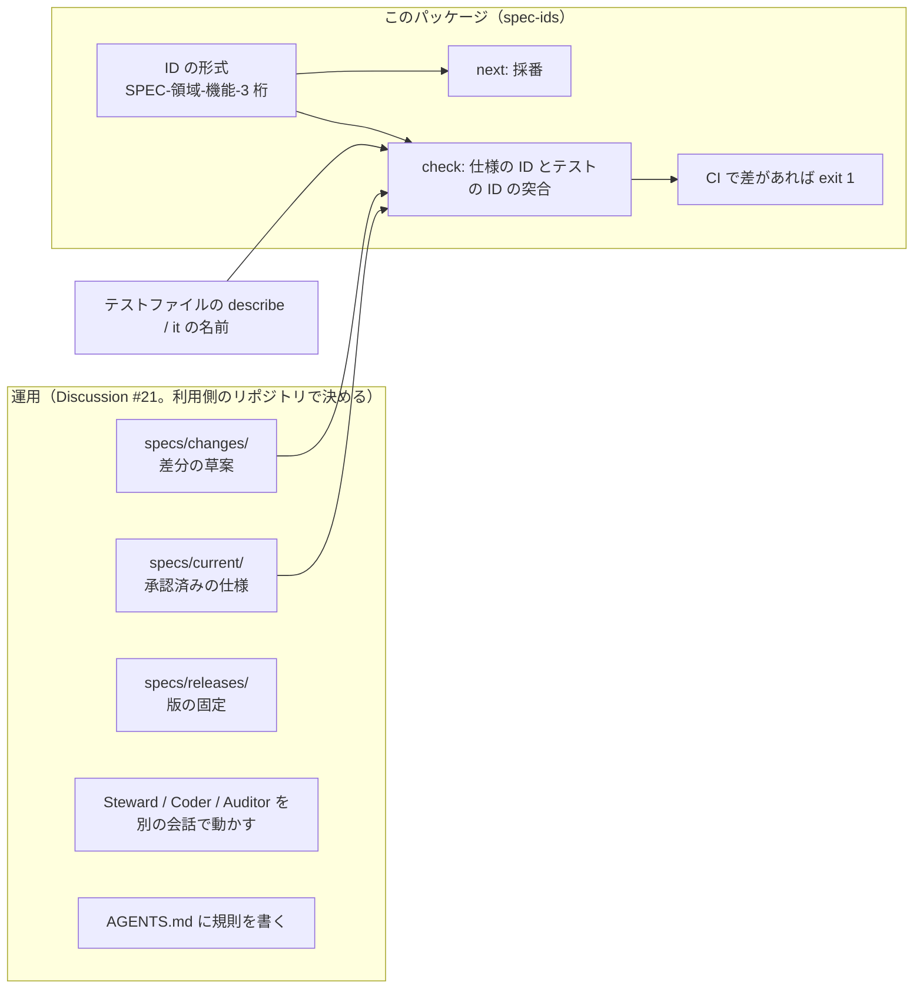

# spec-ids

仕様書の見出しに付けた仕様 ID と、テスト名に付けた仕様 ID を突き合わせて、食い違いがあれば CI で PR を止めるための CLI です。仕様 ID の採番と、仕様の置き場（`specs/`）の初期化も行います。

## 目的と立ち位置

自律的にコードを書くエージェント（Claude Code など）に開発を任せると、実装に合わせて仕様書の文面を直し、「仕様と一致した」と報告することが起きます。機能追加などで仕様自体を変更し実装した場合はこれで良いですが、意図せずに仕様に合わない実装に勝手に変更することを防ぎたいときはこれでは困ります。

これを防ぐ運用として、shuji-bonji/ai-design-advisor Discussion #21「仕様を担保するエージェントの導入と実践」は次を定めています。

- 仕様の正本は `specs/current/` に置き、変更は `specs/changes/` の差分として人が承認する
- 仕様を書く係（Steward）、実装する係（Coder）、突き合わせる係（Auditor）を別の会話で動かす
- 仕様 1 件ごとに ID を振り、受入テストの名前に同じ ID を書く
- 仕様側の ID の集合とテスト側の ID の集合を CI で比べ、差があれば PR を止める

このパッケージが担うのは最後の 1 つと、それに必要な採番だけです。



運用の手順そのもの（誰が何を書いてよいか、承認の流れ、Steward / Auditor の指示文）はこのパッケージには入っていません。

## 決めるものの分担

| 決めるもの                                                               | どこで決まるか                 | 変えられるか                                               |
| ------------------------------------------------------------------------ | ------------------------------ | ---------------------------------------------------------- |
| ID の形式 `SPEC-<領域>-<機能>-<3 桁>`                                    | このパッケージ                 | 変えられない。変えるときはパッケージの版が上がる           |
| `specs/current` / `specs/changes` / `specs/releases` という置き場        | このパッケージ                 | 変えられない。機能をディレクトリ名から導くので、構造が契約 |
| `###` の見出しの先頭が ID である、という仕様書の書き方                   | このパッケージ                 | 変えられない                                               |
| `describe` / `it` / `test` の第 1 引数に ID を書く、というテストの書き方 | このパッケージ                 | 変えられない                                               |
| 領域（`NTA` など）                                                       | 利用側の `specs/spec-ids.json` | 設定 `domain`                                              |
| ディレクトリ名から除く接頭辞（`nta_` など）                              | 利用側の `specs/spec-ids.json` | 設定 `dirPrefix`                                           |
| テストファイルの場所と拡張子                                             | 利用側の `specs/spec-ids.json` | 設定 `tests`                                               |
| 仕様書の本文の書き方（できること / できないこと / 未決 など）            | 利用側                         | このパッケージは見ない                                     |
| 誰が `specs/current/` を書いてよいか、承認の手順                         | 利用側の `AGENTS.md`           | このパッケージは見ない                                     |

## 仕様 ID の形式

```
SPEC-<領域>-<機能>-<3 桁>
例: SPEC-NTA-GET-TSUTATSU-001
```

| 部分 | 決め方                                                                                                                                                      |
| ---- | ----------------------------------------------------------------------------------------------------------------------------------------------------------- |
| 領域 | リポジトリを表す英大文字。設定 `domain`                                                                                                                     |
| 機能 | `specs/current/<dir>/spec.md` のディレクトリ名から、設定 `dirPrefix` の接頭辞を除いて大文字にし、`_` を `-` にしたもの。`nta_get_tsutatsu` → `GET-TSUTATSU` |
| 3 桁 | 機能ごとの通し番号。001 から。機能の中で一度使った番号は再利用しない                                                                                        |

番号の数列をリポジトリ 1 本ではなく機能ごとに分けているので、並行するブランチが番号を取り合うのは「同じ機能の仕様を同時に足したとき」だけです。そのときは `check` の重複検知で止まります。

## 利用側のリポジトリに必要なもの

`check` は次のものがそろっていることを前提にします。

| もの                                    | 作り方                                                       | 内容                                                                                                             |
| --------------------------------------- | ------------------------------------------------------------ | ---------------------------------------------------------------------------------------------------------------- |
| `specs/current/<dir>/spec.md`           | 人（または Steward）が書く。`init` はディレクトリだけ作る    | 承認済みの仕様。`<dir>` は機能ごと（MCP ならツールごと）。見出しの ID の機能はディレクトリ名と一致する必要がある |
| `specs/changes/<id>/spec.md`            | 同上                                                         | 差分の草案。承認前でも `check` の対象になるので、ID を振ったら受入テストも書いてからマージする                   |
| `specs/releases/<tag>/`                 | 利用側の運用で作る（リリース時に `specs/current/` をコピー） | 版の固定。`check` は見ない                                                                                       |
| `specs/spec-ids.json`                   | `init` が作る                                                | 設定                                                                                                             |
| テストファイル                          | 利用側のテスト                                               | `describe` / `it` / `test` の名前に ID を書いたもの                                                              |
| `AGENTS.md`（または `CONTRIBUTING.md`） | 利用側が書く。`init` が貼る節を表示する                      | エージェントと人が守る規則。仕様の正本はどこか、誰が書いてよいか、ID の形式と採番の手順                          |

### 仕様書の書き方

`specs/current/<dir>/spec.md` に、仕様 1 件を `###` の見出しで書きます。見出しの先頭が ID です。

```markdown
### SPEC-NTA-GET-TSUTATSU-001 通達名を略称辞書で解決する

`name` を辞書で正式名に解決する。辞書に無い名前のときは、エラー `ABBREVIATION_NOT_FOUND` を返す。
```

本文の中で他の ID を参照してもかまいません。採番・重複検知・機能の照合は `###` の見出しだけを数えます。見出し以外の節（アクター、できないこと、未決など）の書き方はこのパッケージでは決めていません。

### テストの書き方

`describe` / `it` / `test` の第 1 引数の文字列に ID を入れます。

```ts
it('SPEC-NTA-GET-TSUTATSU-001 辞書に無い名前はエラー', async () => {
  // ...
});
```

コメントや `expect(...)` の中の ID は数えません。名前に書いたものだけが「このテストはこの仕様を検証している」という宣言です。1 つの名前に複数の ID を書けば全部拾います。Vitest、Jest、Jasmine はどれも同じ形です。

### `AGENTS.md` の役割

エージェントがそのリポジトリで作業するときに最初に読む規則です。`init` が表示する節には次が入っています。

- 仕様の正本は `specs/current/` であること。Wiki や README は正本にしないこと
- 変更は `specs/changes/` に出し、人が承認するまで実装を始めないこと
- 実装する係は `specs/current/` を書き換えないこと
- テストの名前に ID を書くこと、ID の形式、`spec-ids next` で採番すること

役割表（Steward / Coder / Auditor / Publisher）や承認の手順は、この節には含まれていません。リポジトリごとに違うので、利用側で書き足します。

## 使い方

### 導入

```bash
npm install --save-dev @shuji-bonji/spec-ids
npx spec-ids init --domain NTA --dir-prefix nta_
```

以下は `init` が作るものです。既にあるファイルは変更せず、「既存のため変更なし」と表示します。

| ファイル                                                                    | 内容                                                    |
| --------------------------------------------------------------------------- | ------------------------------------------------------- |
| `specs/current/.gitkeep` `specs/changes/.gitkeep` `specs/releases/.gitkeep` | 置き場                                                  |
| `specs/spec-ids.json`                                                       | 設定                                                    |
| `.github/workflows/spec-gate.yml`                                           | PR と main への push で `npx spec-ids check` を走らせる |

あわせて、`AGENTS.md`（または `CONTRIBUTING.md`）に貼る節を標準出力に表示します。ファイルには書き込みません。

### 設定 `specs/spec-ids.json`

```json
{
  "domain": "NTA",
  "dirPrefix": "nta_",
  "tests": ["src/**/*.test.ts", "tests/**/*.test.ts"]
}
```

| キー        | 必須                    | 内容                                                                                  |
| ----------- | ----------------------- | ------------------------------------------------------------------------------------- |
| `domain`    | 必須                    | 領域。英大文字                                                                        |
| `dirPrefix` | 任意（既定 `""`）       | ディレクトリ名から機能を導くときに除く接頭辞                                          |
| `tests`     | 任意（既定は上の 2 つ） | テストファイルの glob。`**`、`*`、`?` が使えます。Jasmine なら `["src/**/*.spec.ts"]` |

設定は、コマンドを実行したディレクトリから上へ辿って最初に見つかった `specs/spec-ids.json` を使います。そのディレクトリが基点になります。

### 採番 `spec-ids next`

```bash
npx spec-ids next specs/current/nta_get_tsutatsu/spec.md
# → SPEC-NTA-GET-TSUTATSU-014

npx spec-ids next nta_get_tsutatsu --count 3
# → SPEC-NTA-GET-TSUTATSU-014 SPEC-NTA-GET-TSUTATSU-015 SPEC-NTA-GET-TSUTATSU-016

npx spec-ids next nta_search_qa
# → SPEC-NTA-SEARCH-QA-001（まだ 1 件も無い機能）
```

`specs/current` と `specs/changes` の見出しにあるその機能の最大番号 +1 を表示します。ファイルは書き換えません。番号の予約もしません。

### 突合 `spec-ids check`

```bash
npx spec-ids check
```

次の 4 種類の食い違いを調べ、どれか 1 件でもあれば exit 1 で終わります。

| 種類                                                                                                       | 意味                                                                       |
| ---------------------------------------------------------------------------------------------------------- | -------------------------------------------------------------------------- |
| 仕様の見出しに同じ ID が 2 回以上ある                                                                      | 採番の衝突。並行するブランチで同じ番号を振ったときに、マージ後ここで止まる |
| 仕様にあってテストに無い ID                                                                                | 仕様を書いたが受入テストが無い                                             |
| テストにあって仕様に無い ID                                                                                | 仕様を外したのにテストが残っている、または ID の打ち間違い                 |
| `specs/current/<dir>/spec.md` の見出しの ID の領域・機能が、設定の領域とディレクトリ名から導いた機能と違う | 別の機能の数列を伸ばしている、または別のリポジトリの ID を持ち込んでいる   |

一致しているときの出力です。

```
spec files: 1, spec IDs: 13（見出し: 13）
test files: 41, test IDs: 13
OK: 仕様 ID とテストが一致しています
```

食い違いがあるときは、種類ごとに ID とファイルを並べます。

```
仕様にあってテストに無い ID:
  SPEC-NTA-GET-TSUTATSU-014  (specs/changes/20260922-offline/spec.md)
```

## しないこと

- テストを実行しない（それは `npm test` の仕事）
- 番号の欠番を見ない（`003` を消して `001` `002` `004` になっていても通る）
- 仕様の本文を見ない（`ADDED` / `MODIFIED` / `REMOVED` の意味、承認日の有無）
- `specs/releases/` を見ない
- 承認フローや役割を管理しない
- `specs/current/` へ差分を取り込まない、`specs/releases/` へコピーしない

## Node の API

CLI と同じことをプログラムから呼べます。

```js
import { check, findRoot, loadConfig, nextIds } from '@shuji-bonji/spec-ids';

const root = findRoot();
const config = loadConfig(root);
const result = check(root, config); // { ok, counts, duplicated, missingTests, missingSpecs, misplaced }
const ids = nextIds(root, config, 'nta_get_tsutatsu', 2);
```

## 動作環境

Node.js 22 以上。依存パッケージはありません。

## 開発者向け: リポジトリの構成

| ファイル                        | 役割                                                                                                                                                 |
| ------------------------------- | ---------------------------------------------------------------------------------------------------------------------------------------------------- |
| `bin/spec-ids.mjs`              | CLI。`check` / `next` / `init` / `--version`                                                                                                         |
| `src/format.mjs`                | ID の形式（正規表現、組み立て、分解、ディレクトリ名から機能を導く）。設定では変えられない                                                            |
| `src/config.mjs`                | `specs/spec-ids.json` の探索と検証。`domain` は必須、`dirPrefix` は既定 `""`、`tests` は既定 `src/**/*.test.ts` と `tests/**/*.test.ts`              |
| `src/scan.mjs`                  | `specs/current` / `changes` の走査（構造は固定）、`tests` の glob（`**` `*` `?` のみ、自前）。`node_modules` / `dist` / `coverage` / `.git` は飛ばす |
| `src/check.mjs`                 | 判定 4 つ。結果はオブジェクトで返し、`formatReport` が表示用の行にする                                                                               |
| `src/next.mjs`                  | 採番。`spec.md` のパス、`specs/current/<dir>`、`<dir>` のどれでも受ける                                                                              |
| `src/init.mjs`                  | 置き場・設定・`spec-gate.yml` を作る。既存は変更しない。`AGENTS.md` に貼る節は表示のみ                                                               |
| `templates/`                    | `init` が使う `spec-gate.yml` と `AGENTS.md` の節                                                                                                    |
| `test/*.test.mjs`               | `node:test`。一時ディレクトリに fixture を書いて関数を直接呼ぶ                                                                                       |
| `.github/workflows/ci.yml`      | lint / format:check / test（Node 22, 24）と、`init → check → next` を実際に走らせる smoke test                                                       |
| `.github/workflows/publish.yml` | `v*` タグで npm に publish（OIDC + provenance）。build は無い                                                                                        |

## 出典

shuji-bonji/ai-design-advisor Discussion #21「仕様を担保するエージェントの導入と実践」。最初の適用先は [houki-nta-mcp](https://github.com/shuji-bonji/houki-nta-mcp) です。

## ライセンス

MIT
