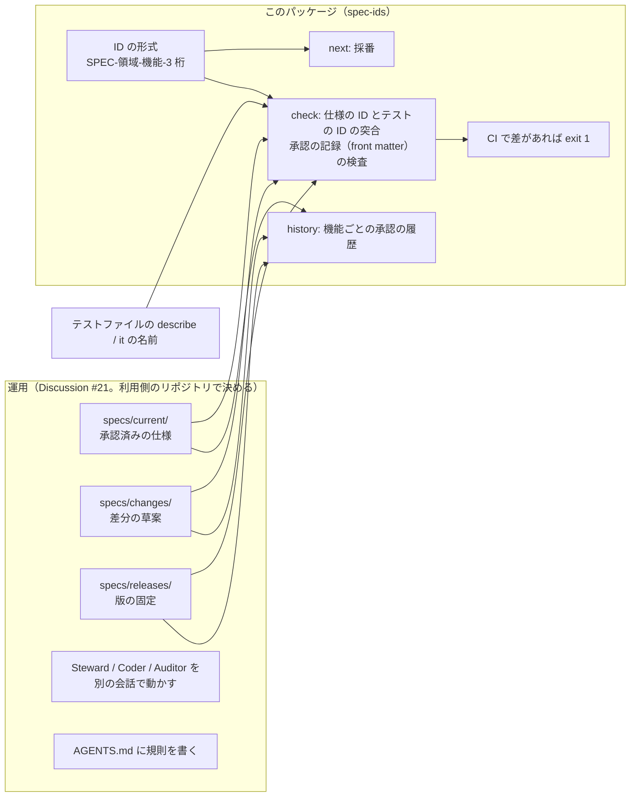

# spec-ids

仕様書の見出しに付けた仕様 ID と、テスト名に付けた仕様 ID を突き合わせて、食い違いがあれば CI で PR を止めるための CLI です。仕様 ID の採番と、仕様の置き場（`specs/`）の初期化も行います。0.3.0 からは、仕様と差分の承認の記録（ファイルの先頭の front matter）を検査し、機能ごとの承認の履歴を表にして表示します。

## 目的と立ち位置

自律的にコードを書くエージェント（Claude Code など）に開発を任せると、実装に合わせて仕様書の文面を直し、「仕様と一致した」と報告することが起きます。機能追加などで仕様自体を変更し実装した場合はこれで良いですが、意図せずに仕様に合わない実装に勝手に変更することを防ぎたいときはこれでは困ります。

これを防ぐ運用として、shuji-bonji/ai-design-advisor Discussion #21「仕様を担保するエージェントの導入と実践」は次を定めています。

- 仕様の正本は `specs/current/` に置き、変更は `specs/changes/` の差分として人が承認する
- 仕様を書く係（Steward）、実装する係（Coder）、突き合わせる係（Auditor）を別の会話で動かす
- 仕様 1 件ごとに ID を振り、受入テストの名前に同じ ID を書く
- 仕様側の ID の集合とテスト側の ID の集合を CI で比べ、差があれば PR を止める

このパッケージが担うのは最後の 1 つと、それに必要な採番、そして承認の記録が決まった形で書かれているかの検査です。


```mermaid
flowchart LR
  subgraph harness["運用（Discussion #21。利用側のリポジトリで決める）"]
    direction TB
    current["specs/current/<br/>承認済みの仕様"]
    changes["specs/changes/<br/>差分の草案"]
    releases["specs/releases/<br/>版の固定"]
    roles["Steward / Coder / Auditor を別の会話で動かす"]
    agents["AGENTS.md に規則を書く"]
  end
  subgraph tool["このパッケージ（spec-ids）"]
    direction TB
    id["ID の形式<br/>SPEC-領域-機能-3 桁"]
    next["next: 採番"]
    check["check: 仕様の ID とテストの ID の突合<br/>承認の記録（front matter）の検査"]
    history["history: 機能ごとの承認の履歴"]
    ci["CI で差があれば exit 1"]
  end
  current --> check
  changes --> check
  releases --> check
  current --> history
  changes --> history
  releases --> history
  tests["テストファイルの describe / it の名前"] --> check
  id --> next
  id --> check
  check --> ci
```

運用の手順そのもの（誰が何を書いてよいか、承認の流れ、Steward / Auditor の指示文）はこのパッケージには入っていません。

## 決めるものの分担

| 決めるもの                                                               | どこで決まるか                 | 変えられるか                                               |
| ------------------------------------------------------------------------ | ------------------------------ | ---------------------------------------------------------- |
| ID の形式 `SPEC-<領域>-<機能>-<3 桁>`                                    | このパッケージ                 | 変えられない。変えるときはパッケージの版が上がる           |
| `specs/current` / `specs/changes` / `specs/releases` という置き場        | このパッケージ                 | 変えられない。機能をディレクトリ名から導くので、構造が契約 |
| `###` の見出しの先頭が ID である、という仕様書の書き方                   | このパッケージ                 | 変えられない                                               |
| 承認の記録を書く front matter のキーと値の形                             | このパッケージ                 | 変えられない                                               |
| `describe` / `it` / `test` の第 1 引数に ID を書く、というテストの書き方 | このパッケージ                 | 変えられない                                               |
| 領域（`NTA` など）                                                       | 利用側の `specs/spec-ids.json` | 設定 `domain`                                              |
| ディレクトリ名から除く接頭辞（`nta_` など）                              | 利用側の `specs/spec-ids.json` | 設定 `dirPrefix`                                           |
| テストファイルの場所と拡張子                                             | 利用側の `specs/spec-ids.json` | 設定 `tests`                                               |
| 仕様書の本文の書き方（できること / できないこと / 未決 など）            | 利用側                         | このパッケージは見ない                                     |
| 誰が `specs/current/` を書いてよいか、承認の手順                         | 利用側の `AGENTS.md`           | このパッケージは見ない（承認の記録の形だけを見る）         |

## 仕様 ID の形式

```
SPEC-<領域>-<機能>-<3 桁>
例: SPEC-NTA-GET-TSUTATSU-001
```

| 部分 | 決め方                                                                                                                                                      |
| ---- | ----------------------------------------------------------------------------------------------------------------------------------------------------------- |
| 領域 | リポジトリを表す英大文字。設定 `domain`                                                                                                                     |
| 機能 | `specs/current/<dir>/spec.md` のディレクトリ名から、設定 `dirPrefix` の接頭辞を除いて大文字にし、`_` を `-` にしたもの。`nta_get_tsutatsu` → `GET-TSUTATSU` |
| 3 桁 | 機能ごとの通し番号。001 から。機能の中で一度使った番号は再利用しない                                                                                        |

番号の数列をリポジトリ 1 本ではなく機能ごとに分けているので、並行するブランチが番号を取り合うのは「同じ機能の仕様を同時に足したとき」だけです。そのときは `check` の重複検知で止まります。

## 利用側のリポジトリに必要なもの

`check` は次のものがそろっていることを前提にします。

| もの                                    | 作り方                                                       | 内容                                                                                                             |
| --------------------------------------- | ------------------------------------------------------------ | ---------------------------------------------------------------------------------------------------------------- |
| `specs/current/<dir>/spec.md`           | 人（または Steward）が書く。`init` はディレクトリだけ作る    | 承認済みの仕様。`<dir>` は機能ごと（MCP ならツールごと）。見出しの ID の機能はディレクトリ名と一致する必要がある |
| `specs/changes/<id>/spec.md`            | 同上                                                         | 承認済みで未出荷の差分。ここにだけある ID にはテストを求めない（仕様 PR をマージしてから実装 PR までの間を通す） |
| `specs/changes/<id>/proposal.md`        | 人（または Steward）が書く                                   | 差分の説明。先頭の front matter に承認日・PR 番号・実装の変更の有無・対象の機能を書く（下の「承認の記録の書き方」） |
| `specs/releases/<tag>/<id>/`            | 利用側の運用で作る（取り込んだ差分を `specs/changes/` から移す） | 取り込み済みの差分。`check` は `proposal.md` の front matter と、差分の `specs/<dir>/` の構成を見る。`spec.md` の見出しの ID は数えない |
| `specs/spec-ids.json`                   | `init` が作る                                                | 設定                                                                                                             |
| テストファイル                          | 利用側のテスト                                               | `describe` / `it` / `test` の名前に ID を書いたもの                                                              |
| `AGENTS.md`（または `CONTRIBUTING.md`） | 利用側が書く。`init` が貼る節を表示する                      | エージェントと人が守る規則。仕様の正本はどこか、誰が書いてよいか、ID の形式と採番の手順                          |

### 仕様書の書き方

`specs/current/<dir>/spec.md` に、仕様 1 件を `###` の見出しで書きます。見出しの先頭が ID です。

```markdown
### SPEC-NTA-GET-TSUTATSU-001 通達名を略称辞書で解決する

`name` を辞書で正式名に解決する。辞書に無い名前のときは、エラー `ABBREVIATION_NOT_FOUND` を返す。
```

本文の中で他の ID を参照してもかまいません。採番・重複検知・機能の照合は `###` の見出しだけを数えます。見出し以外の節（アクター、できないこと、未決など）の書き方はこのパッケージでは決めていません。

### テストの書き方

`describe` / `it` / `test` の第 1 引数の文字列に ID を入れます。

```ts
it('SPEC-NTA-GET-TSUTATSU-001 辞書に無い名前はエラー', async () => {
  // ...
});
```

コメントや `expect(...)` の中の ID は数えません。名前に書いたものだけが「このテストはこの仕様を検証している」という宣言です。1 つの名前に複数の ID を書けば全部拾います。Vitest、Jest、Jasmine はどれも同じ形です。

### 承認の記録の書き方（front matter）

承認日・PR 番号・対象の機能を、ファイルの先頭の front matter に 1 か所だけ書きます。機能ごとの履歴は `spec-ids history` が集めて表示するので、current の `spec.md` に差分ごとの承認を書き足す必要はありません。

差分の `proposal.md`（`specs/changes/<id>/` と `specs/releases/<tag>/<id>/`）:

```yaml
---
approved: 2026-10-01
pr: 89
implementation: required
targets: [common_errors, get_law_range, get_toc, search_fulltext]
---
```

| キー             | 値                                                                   | 草案（`specs/changes/`）       | 取り込み済み（`specs/releases/`） |
| ---------------- | -------------------------------------------------------------------- | ------------------------------ | --------------------------------- |
| `approved`       | 仕様 PR の承認日 `YYYY-MM-DD`（JST）                                 | 空でよい。人がマージの前に書く | 必須                              |
| `pr`             | 仕様 PR の番号（正の整数。`#` は付けない）                           | 空でよい。人がマージの前に書く | 必須                              |
| `implementation` | 実装の変更が要るなら `required`、要らないなら `none`                 | 必須                           | 必須                              |
| `targets`        | この差分が書き換える `specs/current/<dir>/spec.md` の `<dir>` の配列 | 必須（1 つ以上）               | 必須（1 つ以上）                  |

`targets` には、差分の `specs/<dir>/spec.md` を置いた機能だけでなく、ID の無い節（`## 未決` など）だけを直す機能や、差分で新しく作る機能も入れます。草案でも `approved:` と `pr:` のキーは空のまま置いておきます。

current の `spec.md`（`specs/current/<dir>/`）には、初版の承認だけを書きます。

```yaml
---
spec_id: EGOV
kind: tool
approved: 2026-09-28
pr: 50
---
```

| キー            | 値                                                    | 必須か                         |
| --------------- | ----------------------------------------------------- | ------------------------------ |
| `spec_id`       | `specs/spec-ids.json` の `domain` と同じ文字列        | 必須                           |
| `kind`          | `tool`・`cli`・`db`・`common` のどれか                | 任意                           |
| `approved`      | 初版の承認日                                          | `introduced_by` が無ければ必須 |
| `pr`            | 初版の PR 番号                                        | `introduced_by` が無ければ必須 |
| `introduced_by` | この機能を新しく作った差分の ID（差分で作った機能だけ） | 任意                           |

差分を取り込むときに current の front matter は書き換えません。新しい差分の承認は、`proposal.md` が `specs/releases/` に移ることで履歴に入ります。

front matter は YAML のパーサーを使わずに読むので、次の書式だけを受け付けます。

- ファイルの 1 行目が `---`、次の `---` の行までが front matter
- 1 行に `キー: 値` が 1 つ。キーは英小文字と `_`
- 値は、空・`YYYY-MM-DD`・正の整数・英数字と `_` `-` の文字列・`[a, b, c]`（1 行の配列。要素は英数字と `_` `-`）のどれか
- コメント（`#` 以降）、複数行の値、引用符は書けません

### `AGENTS.md` の役割

エージェントがそのリポジトリで作業するときに最初に読む規則です。`init` が表示する節には次が入っています。

- 仕様の正本は `specs/current/` であること。Wiki や README は正本にしないこと
- 変更は `specs/changes/` に出し、人が承認するまで実装を始めないこと
- 実装する係は `specs/current/` を書き換えないこと
- テストの名前に ID を書くこと、ID の形式、`spec-ids next` で採番すること

役割表（Steward / Coder / Auditor / Publisher）や承認の手順は、この節には含まれていません。リポジトリごとに違うので、利用側で書き足します。

## 使い方

### 導入

```bash
npm install --save-dev @shuji-bonji/spec-ids
npx spec-ids init --domain NTA --dir-prefix nta_
```

以下は `init` が作るものです。既にあるファイルは変更せず、「既存のため変更なし」と表示します。

| ファイル                                                                    | 内容                                                    |
| --------------------------------------------------------------------------- | ------------------------------------------------------- |
| `specs/current/.gitkeep` `specs/changes/.gitkeep` `specs/releases/.gitkeep` | 置き場                                                  |
| `specs/spec-ids.json`                                                       | 設定                                                    |
| `.github/workflows/spec-gate.yml`                                           | PR と main への push で `npx spec-ids check` を走らせる |

あわせて、`AGENTS.md`（または `CONTRIBUTING.md`）に貼る節を標準出力に表示します。ファイルには書き込みません。

### 設定 `specs/spec-ids.json`

```json
{
  "domain": "NTA",
  "dirPrefix": "nta_",
  "tests": ["src/**/*.test.ts", "tests/**/*.test.ts"]
}
```

| キー        | 必須                    | 内容                                                                                  |
| ----------- | ----------------------- | ------------------------------------------------------------------------------------- |
| `domain`    | 必須                    | 領域。英大文字                                                                        |
| `dirPrefix` | 任意（既定 `""`）       | ディレクトリ名から機能を導くときに除く接頭辞                                          |
| `tests`     | 任意（既定は上の 2 つ） | テストファイルの glob。`**`、`*`、`?` が使えます。Jasmine なら `["src/**/*.spec.ts"]` |

設定は、コマンドを実行したディレクトリから上へ辿って最初に見つかった `specs/spec-ids.json` を使います。そのディレクトリが基点になります。

### 採番 `spec-ids next`

```bash
npx spec-ids next specs/current/nta_get_tsutatsu/spec.md
# → SPEC-NTA-GET-TSUTATSU-014

npx spec-ids next nta_get_tsutatsu --count 3
# → SPEC-NTA-GET-TSUTATSU-014 SPEC-NTA-GET-TSUTATSU-015 SPEC-NTA-GET-TSUTATSU-016

npx spec-ids next nta_search_qa
# → SPEC-NTA-SEARCH-QA-001（まだ 1 件も無い機能）
```

`specs/current` と `specs/changes` の見出しにあるその機能の最大番号 +1 を表示します。ファイルは書き換えません。番号の予約もしません。

### 突合 `spec-ids check`

```bash
npx spec-ids check
```

仕様の ID は、見出し（`### SPEC-…`）だけを数えます。本文の参照は数えません。見る箱は 2 つです。

| 箱 | 置き場 | 意味 |
| --- | --- | --- |
| current | `specs/current/` の下の `spec.md` | 出荷済みの正 |
| changes | `specs/changes/` の下の `spec.md` | 承認済みでも未出荷の差分 |

次の 7 種類の食い違いを調べ、どれか 1 件でもあれば exit 1 で終わります。1〜4 は仕様 ID とテストの突き合わせ、5〜7（0.3.0 から）は承認の記録の検査です。

| # | 種類 | 見る集合 | 意味 |
| --- | --- | --- | --- |
| 1 | 同じ箱の中で、見出しに同じ ID が 2 回以上ある | current の中、changes の中（current と changes のあいだは見ない） | 採番の衝突。並行するブランチで同じ番号を振ったときに、マージ後ここで止まる |
| 2 | テストに無い ID | current の見出し | 出荷済みの正に受入テストが付いていない |
| 3 | 仕様に無い ID | テストの ID のうち、current にも changes にも見出しが無いもの | 仕様を外したのにテストが残っている、または ID の打ち間違い |
| 4 | 見出しの ID の領域・機能が、設定の領域とディレクトリ名から導いた機能と違う | `specs/current/<dir>/spec.md` の見出し | 別の機能の数列を伸ばしている、または別のリポジトリの ID を持ち込んでいる |
| 5 | front matter の形 | `specs/current/*/spec.md`、`specs/changes/*/proposal.md`、`specs/releases/*/*/proposal.md` | front matter が無い。キーが無い・値の形が違う。知らないキーがある（打ち間違い）。`spec_id` が設定の `domain` と違う。`introduced_by` の差分が無い、またはその差分の `targets` にこの機能が無い |
| 6 | targets の漏れ | `specs/changes/<id>/` と `specs/releases/<tag>/<id>/` | 差分の `specs/<dir>/spec.md` があるのに `<dir>` が `targets` に無い。`specs/changes/` の差分で、`targets` の `<dir>` が `specs/current/` にも差分の `specs/<dir>/` にも無い（打ち間違い） |
| 7 | 古い行の残り | 5 と同じファイル | 「- 承認日:」で始まる行がある（0.2.0 までの、本文に承認日を書く形が残っている） |

5〜7 は次のものを止めません。

- `targets` にあるのに差分の `specs/<dir>/` が無い機能（「実装の変更が要らない」差分や、ID の無い節だけを直す差分で正しく起きる）
- `specs/releases/` の差分の `targets` の `<dir>` が今の `specs/current/` に無いこと（後の差分で機能を消すことがある）
- `proposal.md` の「- 対象:」の文と `targets` の食い違い

`proposal.md` の無いフォルダーは差分として数えません。

current と changes のあいだで重複を見ないのは、`MODIFIED` / `REMOVED` の差分が current と同じ ID の見出しを持つためです。changes の中の重複（2 つの差分が同じ ID の見出しを持つ）は止まります。

仕様を「仕様 PR（`specs/changes/` だけ）」と「実装 PR（テスト・実装・最後に `specs/current/` への取り込み）」の 2 本で変える運用では、次の 3 つの状態がどれも通ります。

| 状態 | 新しい ID がある場所 | 結果 |
| --- | --- | --- |
| 仕様 PR のマージ後 | changes だけ（テストはまだ無い） | 通る |
| 実装 PR の途中 | changes とテスト（current はまだ古い） | 通る |
| 取り込み後 | current とテスト（差分は `specs/releases/` へ移っている） | 通る |

`REMOVED` の差分は例外です。current の見出しが残っているうちにテストを消すと「テストに無い ID」で止まるので、テストを消すのは `specs/current/` から見出しを外す取り込みと同じコミットにします。

一致しているときの出力です。

```
current: 2 files, 22 IDs / changes: 0 files, 0 IDs
proposals: changes 1, releases 5
tests: 41 files, 22 IDs
OK: 仕様 ID とテストが一致しています
```

2 行目の `proposals:` は、`specs/changes/` と `specs/releases/` で見つけた `proposal.md` の数です（0.3.0 から）。

食い違いがあるときは、種類ごとに ID とファイルを並べます。

```
specs/current にあってテストに無い ID:
  SPEC-NTA-GET-TSUTATSU-014  (specs/current/nta_get_tsutatsu/spec.md)

古い「- 承認日:」の行が残っている:
  specs/current/nta_get_tsutatsu/spec.md:6
```

### 承認の履歴 `spec-ids history`

```bash
npx spec-ids history get_toc
npx spec-ids history get_toc --json
npx spec-ids history --all
```

current の `spec.md` の初版の承認と、`specs/releases/` と `specs/changes/` の `proposal.md` のうち `targets` にその機能を含む差分の承認を集め、承認日の順（同じ日は PR 番号の順）に表にします。ファイルは書き換えません。

```
get_toc（SPEC-EGOV-GET-TOC）

| 承認日 | 差分 | PR | 版 |
|---|---|---|---|
| 2026-09-28 | （初版） | #50 | - |
| 2026-09-28 | 20260928-undecided-to-issues | #68 | v0.15.2 |
| 2026-10-01 | 20261002-t1-followups | #89 | v0.16.0 |
```

- 「版」は `specs/releases/<tag>/` の `<tag>` です。`specs/changes/` にある差分は `changes` と表示します
- `approved` が空の差分（承認の前の草案）は表示しません
- `introduced_by` のある機能は、初版の行の代わりに `<差分 ID>（新設）` の行を表示します
- `--json` は同じ内容を JSON で、`--all` はすべての機能を表示します
- 機能が `specs/current/` に無いときは exit 2 で終わります

### 古い形からの変換 `spec-ids migrate`（0.3.0 だけ）

0.2.0 までの、本文の「- 承認日:」「- 機能 ID:」「- 種類:」「- 実装の変更:」の行で承認を記録していたリポジトリを、front matter の形に一度だけ変換するためのサブコマンドです。0.4.0 で外します。

```bash
npx spec-ids migrate          # 書き換えずに、変換の計画と食い違いを表示する
npx spec-ids migrate --json   # 古い形から読んだ承認を JSON で表示する（変換の前後の比較に使う）
npx spec-ids migrate --write  # 食い違いが無いときだけ書き換える
```

| 書くもの                                     | 読む元                                                                                  | 食い違いとして止める場合                         |
| -------------------------------------------- | --------------------------------------------------------------------------------------- | ------------------------------------------------ |
| `proposal.md` の `approved`・`pr`            | `proposal.md` の「- 承認日:」。無ければ current の行の「差分 `<id>` は …」              | 両方にあって値が違う。どちらにも無い             |
| `proposal.md` の `implementation`            | 「- 実装の変更: 要」→ `required`、「不要」→ `none`。括弧書きは「- 実装の変更の補足:」へ | 行が無い                                         |
| `proposal.md` の `targets`                   | current の行にその差分が書かれている `<dir>` と、差分の `specs/<dir>/` の和             | 和が空                                           |
| current の `spec_id`                         | 「- 機能 ID:」                                                                          | 行が無い、または設定の `domain` と違う           |
| current の `kind`                            | 「- 種類:」（`ツール`→`tool`、`CLI`→`cli`、`DB`→`db`、`共通`→`common`）                 | 4 つ以外の値（行が無いときは `kind` を書かない） |
| current の `approved`・`pr`・`introduced_by` | 「- 承認日:」の初版の部分                                                               | 決まった 5 通りの書き方のどれにも合わない        |

このほか、「- 承認日:」の行に読めない文が残っているとき、current の行に書かれている差分の `proposal.md` が無いとき、current の行どうしで同じ差分の承認の値が違うときも、食い違いとして止めます。どれも、そのまま変換すると記録が消えるためです。食い違いが 1 件でもあれば exit 1 で終わり、`--write` は何も書き換えません。front matter が既にあるファイルは、変換済みとして書き換えません。

## しないこと

- テストを実行しない（それは `npm test` の仕事）
- 番号の欠番を見ない（`003` を消して `001` `002` `004` になっていても通る）
- 仕様の本文を見ない（数えるのは `###` の見出しの ID だけ。`ADDED` / `MODIFIED` / `REMOVED` の意味、本文の参照は見ない）。承認の記録は front matter と「- 承認日:」の行だけを見る
- `specs/releases/` の `spec.md` の見出しの ID を数えない（`proposal.md` の front matter と、差分の `specs/<dir>/` の構成だけを見る）
- `proposal.md` の「- 対象:」などの本文と、front matter の `targets` を突き合わせない
- 承認フローや役割を管理しない
- `specs/current/` へ差分を取り込まない、`specs/releases/` へコピーしない

## Node の API

CLI と同じことをプログラムから呼べます。

```js
import { check, findRoot, history, loadConfig, nextIds, readFrontMatter } from '@shuji-bonji/spec-ids';

const root = findRoot();
const config = loadConfig(root);
const result = check(root, config);
// { ok, counts, duplicated, missingTests, missingSpecs, misplaced, frontMatter, missingTargets, legacyLines }
const ids = nextIds(root, config, 'nta_get_tsutatsu', 2);
const h = history(root, config, 'get_toc');
// { dir, specId, rows: [{ kind, approved, change, pr, version }] }

const fm = readFrontMatter(text);
// 1 行目が --- でなければ null。そうでなければ { data, errors, lines }
// data の値は、空なら null、正の整数なら number、配列なら string[]、それ以外は string
```

`readFrontMatter` は、利用側のスクリプト（`check-pr-scope.mjs` など）で front matter の `approved`・`pr`・`implementation` を読むために使えます。`historyAll(root, config)` はすべての機能の履歴を、`formatHistory(h)` は表示用の行を返します。

## 動作環境

Node.js 22 以上。依存パッケージはありません。

## 開発者向け: リポジトリの構成

| ファイル                        | 役割                                                                                                                                                 |
| ------------------------------- | ---------------------------------------------------------------------------------------------------------------------------------------------------- |
| `bin/spec-ids.mjs`              | CLI。`check` / `next` / `init` / `history` / `migrate` / `--version`                                                                                 |
| `src/format.mjs`                | ID の形式（正規表現、組み立て、分解、ディレクトリ名から機能を導く）。設定では変えられない                                                            |
| `src/config.mjs`                | `specs/spec-ids.json` の探索と検証。`domain` は必須、`dirPrefix` は既定 `""`、`tests` は既定 `src/**/*.test.ts` と `tests/**/*.test.ts`              |
| `src/scan.mjs`                  | `specs/current` / `changes` の走査（構造は固定）、`tests` の glob（`**` `*` `?` のみ、自前）。`node_modules` / `dist` / `coverage` / `.git` は飛ばす |
| `src/check.mjs`                 | 判定 1〜4 と、`src/approval.mjs` の 5〜7 をまとめる。結果はオブジェクトで返し、`formatReport` が表示用の行にする                                     |
| `src/frontmatter.mjs`           | front matter の読み取り（`readFrontMatter`）と書き出し。決まった書式だけを読む（YAML のパーサーは使わない）                                          |
| `src/proposals.mjs`             | `specs/current/<dir>/spec.md` と、`specs/changes` / `specs/releases` の `proposal.md` の走査                                                         |
| `src/approval.mjs`              | 判定 5〜7（front matter の形、targets の漏れ、古い「- 承認日:」の行）                                                                                |
| `src/history.mjs`               | 機能ごとの承認の履歴（`history`）                                                                                                                    |
| `src/migrate.mjs`               | 古い形から front matter への変換（`migrate`）。0.3.0 だけに置き、0.4.0 で外す                                                                        |
| `src/next.mjs`                  | 採番。`spec.md` のパス、`specs/current/<dir>`、`<dir>` のどれでも受ける                                                                              |
| `src/init.mjs`                  | 置き場・設定・`spec-gate.yml` を作る。既存は変更しない。`AGENTS.md` に貼る節は表示のみ                                                               |
| `templates/`                    | `init` が使う `spec-gate.yml` と `AGENTS.md` の節                                                                                                    |
| `test/*.test.mjs`               | `node:test`。一時ディレクトリに fixture を書いて関数を直接呼ぶ                                                                                       |
| `.github/workflows/ci.yml`      | lint / format:check / test（Node 22, 24）と、`init → check → next → history` を実際に走らせる smoke test                                                       |
| `.github/workflows/publish.yml` | `v*` タグで npm に publish（OIDC + provenance）。build は無い                                                                                        |

## 出典

shuji-bonji/ai-design-advisor Discussion #21「仕様を担保するエージェントの導入と実践」。最初の適用先は [houki-nta-mcp](https://github.com/shuji-bonji/houki-nta-mcp) です。

## ライセンス

MIT
