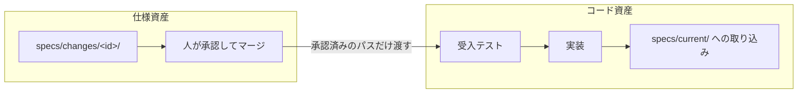
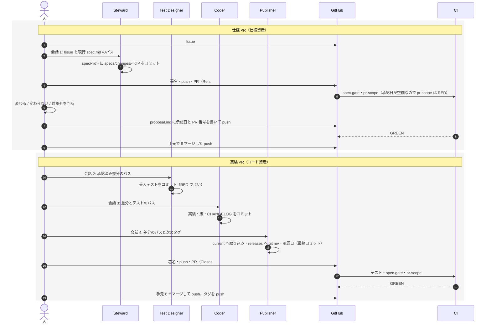
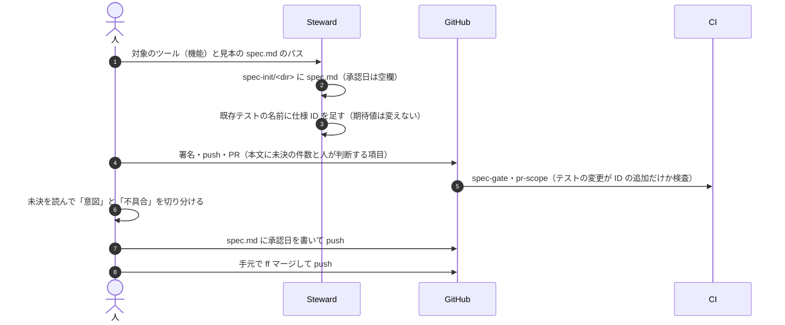

# 運用手順: 仕様とコードを 2 本の PR で変える

- 対象: `@shuji-bonji/spec-ids` を使うリポジトリで、仕様の作成・変更と実装を進める人とエージェント
- 状態: 試行版。houki-nta-mcp で 2026-09-24〜26（JST）に回した記録から起こした
- 前提の手順: [Discussion #1「仕様を担保するエージェントの導入と実践」](https://github.com/shuji-bonji/spec-ids/discussions/1)（役割と順序）

この文書は、Discussion #1 が決めた役割と順序を、git と GitHub の操作（ブランチ・コミット・PR・承認・マージ・タグ）に対応させた手順書です。仕様をコードと同じリポジトリにある別種の開発資産として扱い、人が振る舞いを承認する場所を仕様 PR 1 か所にします。

## 1. 考え方

### 1.1 2 つの資産

| 資産 | 置き場 | 人が問うこと |
|---|---|---|
| 仕様資産 | `specs/changes/<id>/`（差分）、`specs/current/`（出荷済みの正）、`specs/releases/<tag>/`（取り込み済みの差分） | 変わる振る舞い / 変わらない振る舞い / 対象外 |
| コード資産 | テスト、`src/`、版、CHANGELOG | 承認済みの文と、テストと、コードが同じか。コードの品質 |

- 振る舞いに何を許すかは、仕様 PR で決める。実装 PR のレビューに持ち込まない
- `specs/current/` は仕様資産だが、書き換えるのは実装が main に入るとき（実装 PR の最終コミット）。仕様 PR で先に書き換えると、リポジトリ上の正が未出荷の振る舞いになる
- 仕様 ID 付きの受入テストはコード資産。書く順番だけは「仕様の承認の後、実装の前」



### 1.2 PR の種類

| ブランチ | 種類 | 入れてよいもの | 入れないもの | 人の判断 |
|---|---|---|---|---|
| `spec/<yyyymmdd>-<slug>` | 仕様 PR | `specs/changes/<id>/proposal.md` と差分の `spec.md`、承認日と PR 番号 | `src/`、テスト、`specs/current/`（例外: 下の「実装の変更: 不要」） | 変わる振る舞い / 変わらない振る舞い / 対象外 |
| `spec-init/<dir>` | 初版起こし | `specs/current/<dir>/spec.md`、既存テストの名前への仕様 ID の追加 | テストの期待値と本文、実装 | 今の動きを意図として認めるか、不具合か |
| それ以外（`feat/` `fix/` `docs/` など） | 実装 PR | テスト、`src/`、版と CHANGELOG、最終コミットの取り込み（`specs/current/` の更新と `specs/changes/` → `specs/releases/<tag>/` の移動） | 未承認の意図の追加、承認済み差分の書き換え | 通常のコードレビュー。仕様の再承認ではない |

- 仕様 PR の proposal.md に「- 実装の変更: 不要」と書いた差分（出荷済みの振る舞いを書き直すだけのもの）は、仕様 PR の中で `specs/current/` を書いてよい。正が未出荷にならないため
- 初版起こしは 1 本の PR にする。`spec.md` とテスト名の ID を分けると、どちらを先にマージしても `spec-ids check` が止まる

### 1.3 役割

同じ会話に「書く係」「実装する係」「突き合わせる係」を置きません。次の係には成果物のパスだけを渡し、要約して渡しません。

| 役割 | 書くもの | 書かないもの |
|---|---|---|
| 人 | 承認（仕様 PR のマージ）、承認日、署名、push、マージ、タグ | 仕様やコードの全文 |
| Spec Steward | 差分の草案（`specs/changes/<id>/`）、初版起こしの `specs/current/` | 実装、テストの期待値 |
| Test Designer | 仕様 ID 付きの受入テスト | 実装を見て期待値を足すこと、仕様本文 |
| Coder | 実装、版、CHANGELOG | `specs/`、テストの期待値 |
| Spec Publisher | 実装 PR の最終コミットの取り込み | 実装、テスト、未承認の意図 |
| Spec Auditor | 仕様 ID ごとの一致 / 不一致の報告 | 仕様・実装・テストのどれも |

## 2. 流れ

### 2.1 仕様を変える（仕様 PR → 実装 PR）



### 2.2 初版を起こす（初版起こし PR）



不具合に見える動きは「できること」に入れず「未決」に書き、意図か不具合かを人が決めます。不具合と決めたものは、別の Issue と仕様 PR にします。

## 3. git と GitHub のイベント

| 段階 | イベント | 誰 | 確かめること |
|---|---|---|---|
| きっかけ | Issue を立てる | 人 | 変わる振る舞いを 3 行以内で書く |
| 仕様 PR | `spec/<yyyymmdd>-<slug>` を main から切る | Steward | ID は `npx spec-ids next <dir> --count N` で取る |
| 仕様 PR | 署名して push、PR を開く（`Refs #N`） | 人 | CI の `spec-gate` が GREEN。`pr-scope` は承認日が入るまで RED |
| 承認 | proposal.md の「- 承認日: YYYY-MM-DD（PR #N）」を書いて push | 人 | `pr-scope` が GREEN |
| 承認 | 手元で `git merge --ff-only` して push | 人 | main の `spec-gate` が GREEN（新しい ID が changes にだけあってもテストを求めない） |
| 実装 PR | 実装用のブランチを main から切る | Test Designer | テストのコミットを最初に置く |
| 実装 PR | 実装・版・CHANGELOG のコミット | Coder | テストの期待値を変えていない |
| 実装 PR | 取り込みのコミット（最終） | Publisher | `specs/changes/` が空、`specs/releases/<tag>/` に移動、`spec-ids check` と `pr-scope` が通る |
| 実装 PR | 署名して push、PR を開く（`Closes #N`） | 人 | CI が GREEN |
| 公開 | 手元で ff マージして push、タグを push | 人 | publish のワークフローが成功 |
| 追随 | 利用側のサイト・プラグイン・レジストリの更新 | 人 | リポジトリごとに違う（付録 A） |

### 3.1 マージは手元の ff マージにする

GitHub の 3 つのマージボタンは、どれも PR のコミットをそのまま main に載せません。

| 方法 | main に載るもの | 署名 |
|---|---|---|
| Create a merge commit | PR のコミット + マージコミット | PR のコミットには残る |
| Squash and merge | 1 つにまとめた新しいコミット | 残らない |
| Rebase and merge | 作り直したコミット（SHA が変わる） | 残らない |
| 手元で `git merge --ff-only` して push | PR のコミットそのもの | 残る |

実装 PR のコミットの順（テスト → 実装 → 取り込み）が main に残ると、「テストを先に書き、Coder は期待値を変えていない」ことを `git log` で追えます。

```bash
git switch main
git pull --ff-only
git merge --ff-only <PRのブランチ>
git push origin main
```

### 3.2 承認日

- 承認日は、人がマージの前にそのブランチで書く。マージの後に書くと、承認日を書くためだけの PR が要る
- 仕様 PR: `specs/changes/<id>/proposal.md` に「- 承認日: YYYY-MM-DD（PR #N）」
- 初版起こし: `specs/current/<dir>/spec.md` に「- 承認日: YYYY-MM-DD」
- 取り込み: Publisher が `specs/current/<dir>/spec.md` の承認日に「差分 `<id>` は YYYY-MM-DD（PR #N）」を足す

## 4. CI

| ジョブ | 何を止めるか | 実装 |
|---|---|---|
| `spec-gate` | 仕様 ID とテストの食い違い（current の ID にテストが無い、テストの ID にどの見出しも無い、同じ箱の中の重複、機能名の不一致） | `npx spec-ids check`（0.2.0 以上） |
| `pr-scope` | PR の種類ごとに変えてよいパスの外の変更、承認日の空欄 | houki-nta-mcp の `.github/scripts/check-pr-scope.mjs`（今はリポジトリごとにコピー） |

`spec-ids check` 0.2.0 の突き合わせは次のとおりです。仕様 PR の後、実装 PR の途中、取り込みの後のどの状態でも通ります。

| 検査 | 見る集合 |
|---|---|
| テストに無い ID | `specs/current/` の見出し |
| 仕様に無い ID | `specs/current/` と `specs/changes/` の見出しの和 |
| 見出しの重複 | current の中と changes の中を別々に |
| 機能名の不一致 | `specs/current/<dir>/spec.md` の見出し |

## 5. 差分の書き方

差分の `spec.md` は見出しの単位で書きます。取り込みは、この単位で置き換えるだけで済む形にします。

- `## MODIFIED` の `### SPEC-…`: current の同じ ID の節（見出しから次の `###` または `##` の手前まで）を丸ごと置き換える
- `## ADDED` の `### SPEC-…`: current の「できること」の末尾に足す
- `## REMOVED` の `### SPEC-…`: current から消す。テストの ID を外すのは取り込みと同じコミット
- `## 入力` `## できないこと` `## 未決` など ID の無い節: current の同じ見出しの節を丸ごと置き換える

人が差分を読むときは、取り込みの前後を `git diff --no-index --word-diff` で並べると、見慣れた diff の形で確かめられます。

## 6. 各役への指示文

どの指示文も「役」「ブランチ」「読むもののパス」「規則（AGENTS.md）」「コミットの単位」を書き、内容の要約は書きません。

### Steward（仕様 PR）

```
<リポジトリ> の Issue #N について、仕様 PR の差分草案を書いてください。役は Spec Steward です。実装とテストは書きません。
ブランチ: spec/<yyyymmdd>-<slug>（main から切る）
読むもの: Issue #N、specs/current/<dir>/spec.md、AGENTS.md
書くもの: specs/changes/<yyyymmdd>-<slug>/proposal.md（変わる振る舞い / 変わらない振る舞い / 対象外 / 人が判断すること、「- 実装の変更: 要 / 不要」、承認日は空欄）と specs/<dir>/spec.md（見出し単位の差分）
ID は npx spec-ids next <dir> --count N で取る。コミットは 1 つ。
```

### Test Designer（実装 PR の最初）

```
<リポジトリ> の実装 PR の受入テストを書いてください。役は Test Designer です。実装は見ません。
ブランチ: <実装用ブランチ>（main から切る）
承認済みの差分: specs/changes/<id>/specs/<dir>/spec.md
規則: AGENTS.md。テスト名の先頭に仕様 ID を書く。外部サイトは差し替える。
既存テストの期待値が承認済みの差分で変わる場合は、準備の部分を直してよい。期待値を変えるなら理由を報告する。
コミットは「test: …」の 1 つ。
```

### Coder

```
<リポジトリ> の #N を実装してください。役は Coder です。specs/ は書き換えません。
ブランチ: <実装用ブランチ>
承認済みの差分: specs/changes/<id>/specs/<dir>/spec.md
受入テスト: このブランチの test: で始まるコミット
規則: AGENTS.md。テストの期待値は変えない。版と CHANGELOG を更新する。コミットは「feat:」または「fix:」で始める。
```

### Publisher（実装 PR の最後）

```
<リポジトリ> の実装 PR の最終コミットとして、承認済み差分を specs/current/ に取り込んでください。役は Spec Publisher です。実装とテストは触りません。
ブランチ: <実装用ブランチ>
差分: specs/changes/<id>/
やること: 見出し単位で current に取り込む、承認日と「取り込んだ差分」の行を足す、git mv で specs/releases/<次のタグ>/ へ移す、proposal.md の「状態」を取り込み済みにする、spec-ids check と pr-scope が通ることを確かめる。
コミットは「spec: <id> を specs/current/ に取り込み、releases/<tag>/ へ移す」の 1 つ。
```

## 7. 回してみて分かったこと

houki-nta-mcp で差分 2 件（`20260924-tsutatsu-clause-forms`、`20260925-tsutatsu-live-toc`）と初版起こし 2 件を回した記録です。

| 起きたこと | 原因 | 対処 |
|---|---|---|
| 1 つの差分に PR が 4 本かかった（差分草案・実装・取り込み・承認日） | 承認・実装・取り込みをそれぞれマージで区切っていた | 仕様 PR と実装 PR の 2 本にし、取り込みは実装 PR の最終コミットにした |
| 承認日を書くためだけの PR が要った | 承認（マージ）の後でないと日付を書けないと考えていた | 人がマージの前にそのブランチで書く。`pr-scope` が空欄を止める |
| 仕様 PR をマージすると main の `spec-gate` が RED になる見込みだった | spec-ids 0.1.0 が `specs/changes/` の ID にもテストを求めていた | spec-ids 0.2.0 で突き合わせを current と changes に分けた |
| 実装 PR を 2 段階に分けたら、途中の段階で返す内容が仕様に無かった | 段階 1 のテストが、段階 2 の処理が無いと決まらない振る舞いを含んでいた | 実装 PR を 1 本にまとめた。出荷しない途中の状態のために仕様を書かない |
| main でコミットの順（テスト → 実装 → 取り込み）が消えた | GitHub の Squash and merge を使った | 手元の ff マージにする |
| 手元で `spec-ids check` が CI と違う結果を出した | 手元の node_modules が古い版のまま | 依存を上げた後は `npm ci` をやり直す |
| 差分を読みづらい場面があった | 文面の大きな書き換え | 見出し単位の差分にし、`git diff --no-index --word-diff` を併用する |
| 初版起こしで、仕様に書かれたとおりの動きが不具合だった（一度取得すると同じ通達の他の節が取れない） | 初版は実装から起こすので、不具合も文面に入る | 未決に書き、Issue → 仕様 PR にする。試用（実際の呼び出し）で見つかることが多い |

## 8. 実行する環境ごとの違い

役割を分ける規則と、2 本の PR の流れは、どこで回しても同じです。変わるのは「誰が push するか」「会話をどう分けるか」「どこで止めるか」です。

| 項目 | Cowork（今回） | Claude Code（手元の端末） | Claude Code のクラウドセッション |
|---|---|---|---|
| 作業する場所 | Cowork の VM から、手元の Mac の作業フォルダーを読み書き | 手元の Mac の作業フォルダー | Anthropic のクラウドの VM に GitHub のリポジトリを clone |
| GitHub への push・PR | エージェントからは届かない。人が push し、PR 本文を貼る | 人の git と `gh` の設定をそのまま使える | エージェントがブランチを push し、画面から PR を作れる |
| 署名 | エージェントのコミットは未署名。人が `rebase --exec` で署名して push | 人の署名設定がそのまま効く | 署名鍵はサンドボックスの外に置かれ、プロキシが扱う。GitHub 上でどの鍵の署名として表示されるかは、最初の 1 回で確かめる |
| 会話を分ける方法 | 役ごとに別の会話 | 役ごとに別のセッション、またはサブエージェント（`.claude/agents/`） | 役ごとに別のセッション（並べて走らせられる）、またはサブエージェント |
| hooks | 効かない（VM のシェルで書くため） | リポジトリの `.claude/settings.json` の hooks が効く | リポジトリにコミットした `.claude/settings.json` の hooks が効く |
| 止める主な場所 | CI | hooks（手元）と CI | CI。hooks はリポジトリにコミットしたものだけ |
| つまずき | 削除の許可が切れると `.git` にロックファイルが残る。手元の node_modules は macOS 用 | 手元の状態（未コミットの変更、古い依存）がそのまま入る | 手元の設定は使われない。依存や DB が要るなら環境の setup script に書く |

### 8.1 クラウドセッションで変わること

- **push と PR をエージェントが行える。** 仕様 PR・実装 PR とも、ブランチの push と PR の作成までをセッションの中で終えられる。人が行うのは、承認日を書くこと（またはその指示）と、マージとタグ
- **マージの方法を決めておく必要がある。** クラウドセッションが作った PR も、GitHub のボタンで取り込むと 3.1 の問題が起きる。手元の ff マージにするか、署名を要件にしない運用にするかを先に決める
- **役割ごとにセッションを並べられる。** Test Designer と Coder を別のセッションにしても、互いにブランチを push して受け渡せる。受け渡しはブランチ名とパスで行う
- **CI の失敗への対応を任せられる（Auto-fix）。** Claude GitHub App を入れると、PR の CI の失敗やレビューのコメントにセッションが応じる。ただし「テストの期待値を変えない」を AGENTS.md と `pr-scope` で止めておかないと、テストを直して GREEN にする応じ方をしうる
- **hooks をリポジトリに置く意味が出る。** クラウドセッションは手元の設定を読まないので、止めたい規則は `.claude/settings.json`（コミットする）と CI に置く。houki-nta-mcp は今 `.claude/` を .gitignore しているので、hooks を使うなら見直しが要る

### 8.2 おすすめの組み合わせ

| 役 | 環境 | 理由 |
|---|---|---|
| Steward（差分草案・初版起こし） | Cowork または手元の Claude Code | 試用（実際の MCP の呼び出し）や人との相談が多い |
| Test Designer・Coder | クラウドセッション | 手順が決まっていて、並べて走らせられる。push と PR まで任せられる |
| Publisher | クラウドセッション、または手元 | 機械的な取り込み。spec-ids 0.3.0 の `apply` が入ればスクリプトで足りる |
| 人 | 手元 | 承認、署名、ff マージ、タグ |

## 9. 他のリポジトリへの導入

1. `npx @shuji-bonji/spec-ids@0 init --domain <領域> --dir-prefix <接頭辞>` で `specs/`・`specs/spec-ids.json`・`spec-gate.yml` を作る
2. AGENTS.md に「仕様の正本」「仕様 ID」「PR の種類」「役割」の節を置く（houki-nta-mcp の AGENTS.md が見本）
3. `pr-scope` を入れる（今は houki-nta-mcp の `.github/scripts/check-pr-scope.mjs` と `ci.yml` のジョブをコピー）
4. 最初の 1 機能を初版起こし（`spec-init/<dir>`）で入れ、テスト名に ID を付ける
5. main のマージ方法を手元の ff マージにそろえる（GitHub の設定で squash と rebase のボタンを外す）

テストの書き方がリポジトリごとに違う点（Vitest の `it`、Jasmine の `describe`、`node:test` の `test`）は、`specs/spec-ids.json` の `tests` の glob で合わせます。`spec-ids check` は `describe` / `it` / `test` の第 1 引数の文字列を読みます。

## 10. まだ決まっていないこと

| 項目 | 状態 |
|---|---|
| 取り込みの自動化（`spec-ids apply`） | 5 章の書式で houki-nta-mcp の差分 2 件を手で取り込んだ。書式が固まったら 0.3.0 に入れる |
| `pr-scope` の置き場 | 今はリポジトリごとのコピー。3 つ目のリポジトリに入れる前に、spec-ids のコマンドにするか決める |
| Auditor | 今は人の目と CI だけ。ID ごとの一致を CI の結果から PR に出す形を検討する |
| クラウドセッションの署名 | どの鍵の署名として GitHub に出るかを、最初の運用で確かめて 8 章を直す |

## 付録 A. houki-nta-mcp での追随作業

実装 PR をマージしてタグを push した後に行うこと（houki 系の MCP の例）。

1. タグの push で `publish.yml` が npm に公開する
2. `mcp-publisher publish` で MCP Registry に公開する
3. claude-plugins の版を上げる
4. houki-hub で `npm run build`（ツールリファレンスの再生成）と `node scripts/generate-stack.mjs --readme`。応答が変わったツールは `scripts/reference-examples/` の呼び出し例を取り直す
5. Issue に返信して close する
