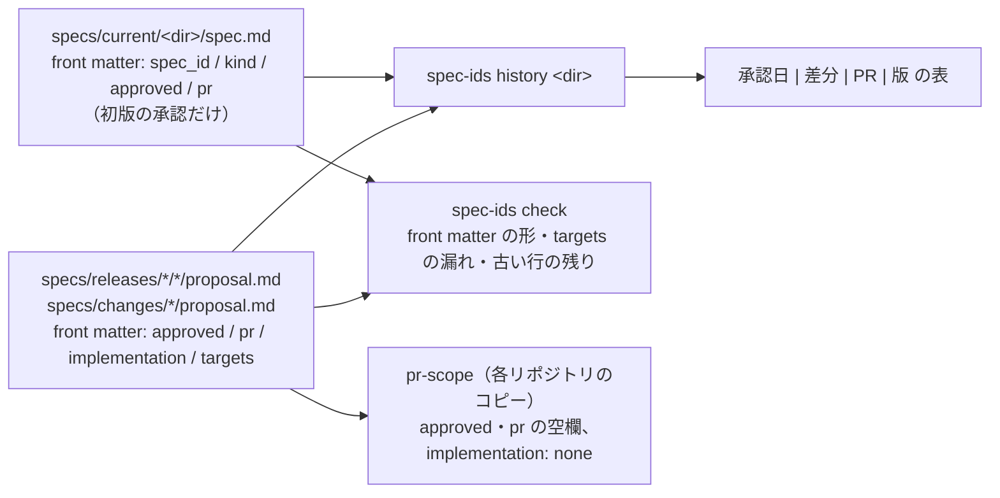
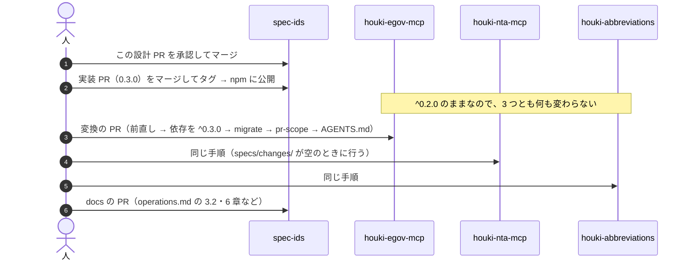

# 変更: 承認の記録を proposal.md の front matter に移し、current の承認日の行を手で書き足さないようにする（#5）

- 対象: spec-ids の `spec-ids check`（検査を 3 つ足す）、新しいサブコマンド `spec-ids history` と `spec-ids migrate`、Node の API（`readFrontMatter` を足す）。利用側の houki-egov-mcp・houki-nta-mcp・houki-abbreviations の `specs/` と `.github/scripts/check-pr-scope.mjs`（変換の PR で変わる）
- 実装の変更: 要（spec-ids 0.3.0。下の「変えた後の動き」と「実装 PR で直す文書」）
- 承認日: 2026-10-09（PR #6）
- 状態: 草案
- 起こした日: 2026-10-09（JST）
- 起こした役: Spec Steward（`docs/operations.md` の 1.3）
- 対象 Issue: spec-ids #5（承認の記録を proposal.md の front matter に移し、current の承認日の行を手で書き足さないようにする）
- 出発点: shuji の指示書（2026-10-09 JST）の Q18〜Q20 と、targets の検査・変換・移行の間の扱い・版の案。この文書の「人が判断すること」に並べ直し、この PR で承認を受ける
- 前提: main の `6e3964c` から切った。2026-10-09 JST に `git ls-remote https://github.com/shuji-bonji/spec-ids refs/heads/main` で origin の main と同じことを確かめた。利用側は houki-egov-mcp `326006f`・houki-nta-mcp `c75e86a`・houki-abbreviations `50bd63b` を読んだ（3 つとも同じ日に `git ls-remote` で origin の main と同じことを確かめた）
- 置き場: spec-ids には `specs/` が無いので、この文書 1 本に houki 系の proposal.md と同じ節の並びを持たせる

## なぜ変えるか

houki 系の 3 リポジトリでは、差分を `specs/current/` に取り込むたびに、Publisher が `specs/current/<dir>/spec.md` の「- 承認日:」の行に「差分 `<id>` は YYYY-MM-DD（PR #N）」を書き足しています（`docs/operations.md` の 3.2）。この運用には次の 3 つの問題があります。

1. **同じ事実を 2 か所に手で書いている。** 差分の承認日と PR 番号は `specs/releases/<tag>/<id>/proposal.md` の「- 承認日:」にもある。1 つの差分が 20 本の spec.md に関わると、20 本の行を手で書き足す（houki-egov-mcp の `20260928-undecided-to-issues`）
2. **行が長くなり続ける。** 2026-10-09 JST の時点で最も長い行は、houki-nta-mcp の `specs/current/nta_get_jimu_unei/spec.md` の 988 バイト、houki-egov-mcp の `specs/current/search_fulltext/spec.md` の 747 バイト（Issue を立てた `3ca848e` の時点では 687 バイト）
3. **機械で集計できず、2 か所の記録が食い違っている。** どの機能が差分の対象かは proposal.md の「- 対象:」に文章で書かれているだけで、機械では読めない。current の行と releases を突き合わせると、3 リポジトリの取り込み済みの 50 件の差分のうち 20 件で、対象の機能の集合か承認の値が食い違っている（「確かめた値」）

この差分は、承認の記録を 1 か所（proposal.md の front matter）に置き、機能ごとの履歴は `spec-ids history` が集めて出す形に変えます。

## 今の動き（spec-ids 0.2.0 と、利用側の 3 リポジトリ）

### spec-ids 0.2.0

- `spec-ids check` は `specs/current/` と `specs/changes/` の `spec.md` の `###` の見出しと、テスト名の ID だけを見る。proposal.md、承認日、`specs/releases/` は見ない（README の「しないこと」）
- 承認日の有無を検査するのは、各リポジトリにコピーした `.github/scripts/check-pr-scope.mjs`（`pr-scope`）だけ
- 依存パッケージは無い（README の「動作環境」）

### 利用側の proposal.md

冒頭の箇条書きに、次の 3 行が文章で書かれています（例は houki-egov-mcp の `specs/releases/v0.16.0/20261002-t1-followups/proposal.md`）。

```markdown
- 対象: `specs/current/common_errors/spec.md`（SPEC-EGOV-COMMON-ERRORS-022）、`specs/current/get_law_range/spec.md`（SPEC-EGOV-GET-LAW-RANGE-023）、`specs/current/get_toc/spec.md` と `specs/current/search_fulltext/spec.md`（「未決」の各 1 行）
- 実装の変更: 要（テストを 1 件足すだけ。実装は `feat/20261001-0.16.0` に入っている。下の「実装の変更」）
- 承認日: 2026-10-01（PR #89）
```

houki-nta-mcp の `specs/releases/v0.20.3/20260924-tsutatsu-clause-forms/proposal.md` には「- 承認日:」と「- 実装の変更:」の行がありません（運用を決める前の差分）。

### 利用側の current の spec.md

冒頭の箇条書きに「- 機能 ID:」「- 種類:」「- 版:」「- 承認日:」があります。「- 承認日:」の行には初版の承認と、取り込んだ差分ごとの承認が 1 行につながっています（例は houki-egov-mcp の `specs/current/get_toc/spec.md`）。

```markdown
- 機能 ID: EGOV
- 種類: ツール
- 版: current
- 承認日: 2026-09-28（PR #50）。差分 `20260928-undecided-to-issues` は 2026-09-28（PR #68）。差分 `20260928-untested-behaviors` は 2026-09-28（PR #76）。差分 `20261001-t1-argument-guards` は 2026-10-01（PR #84）。（中略）差分 `20261003-law-resolution` は 2026-10-03（PR #95）
```

初版の部分の書き方は 1 通りではありません。3 リポジトリで次の 5 通りがあります。

| 書き方                     | 例                                                              | どこで                                                  |
| -------------------------- | --------------------------------------------------------------- | ------------------------------------------------------- |
| `YYYY-MM-DD（PR #N）`      | `2026-09-28（PR #50）`                                          | egov 20 本、nta 5 本                                    |
| 日付と括弧のあいだに空白   | `2026-09-27 （PR #77）`                                         | nta 2 本（`common_errors`・`search_rules`）、abbr 23 本 |
| `（初版。PR #N のマージ）` | `2026-09-24（初版。PR #52 のマージ）`                           | nta 2 本（`nta_get_qa`・`nta_get_tsutatsu`）            |
| 初版と差分が同じ PR        | ``2026-09-26（初版と差分 `20260926-processing-flow`。PR #63）`` | nta 12 本                                               |
| 差分で新しく作った機能     | ``2026-10-05（PR #142。差分 `20261004-db-location`）``          | nta 1 本（`cli_status`）                                |

差分の部分にも `（PR #53 のマージ）` の形が 1 つあります（nta の `nta_get_tsutatsu` の `20260924-tsutatsu-clause-forms`）。

### 利用側の pr-scope

3 リポジトリの `.github/scripts/check-pr-scope.mjs` は、中身が少しずつ違うコピーです（md5 が 3 つとも違う）。承認に関わる判定は 3 つとも同じ正規表現を使っています。

| 判定                               | 正規表現                                                                             | 何を止めるか                                     |
| ---------------------------------- | ------------------------------------------------------------------------------------ | ------------------------------------------------ |
| 仕様 PR の proposal.md の承認      | `APPROVAL_RE = /^- 承認日: \d{4}-\d{2}-\d{2}/m` と、その行の `PR_NUMBER_RE = /#\d+/` | 承認日か PR 番号が無い proposal.md               |
| 仕様 PR が current を書いてよいか  | `NO_IMPL_RE = /^- 実装の変更: 不要/m`                                                | 「不要」でない差分が `specs/current/` を書くこと |
| 変わった current の spec.md の承認 | `APPROVAL_RE`                                                                        | 承認日の行が無い spec.md                         |

### 3 リポジトリの spec-ids の版

3 つとも `devDependencies` に `"@shuji-bonji/spec-ids": "^0.2.0"` と書いています。0.x の `^` は minor を跨がないので、spec-ids 0.3.0 を公開しても、各リポジトリが依存を上げるまで 0.2.0 のままです。

## 変えた後の動き



### proposal.md の front matter

承認の記録・実装の変更の有無・対象の機能を、ファイルの先頭の front matter に書きます。

```yaml
---
approved: 2026-10-01
pr: 89
implementation: required
targets: [common_errors, get_law_range, get_toc, search_fulltext]
---
```

| キー             | 値                                                                   | 草案（`specs/changes/`）       | 取り込み済み（`specs/releases/`） |
| ---------------- | -------------------------------------------------------------------- | ------------------------------ | --------------------------------- |
| `approved`       | `YYYY-MM-DD`（JST）                                                  | 空でよい。人がマージの前に書く | 必須                              |
| `pr`             | 仕様 PR の番号（正の整数。`#` は付けない）                           | 空でよい。人がマージの前に書く | 必須                              |
| `implementation` | `required`（今の「実装の変更: 要」）か `none`（今の「不要」）        | 必須                           | 必須                              |
| `targets`        | この差分が書き換える `specs/current/<dir>/spec.md` の `<dir>` の配列 | 必須（1 つ以上）               | 必須（1 つ以上）                  |

- `targets` には、差分の `specs/<dir>/spec.md` を置いた機能だけでなく、「取り込みのとき（Publisher）」の指示で `## 未決` や「処理の流れ」の図など ID の無い節を直す機能も入れる。今の current の行に書かれている機能の集合と同じ意味にする
- 差分で新しく作る機能（nta の `cli_status`）も `targets` に入れる
- 「- 実装の変更:」の行の括弧書き（「テストを 1 件足すだけ」など）は、本文の箇条書き「- 実装の変更の補足:」に残す（「人が判断すること」Q21）
- 「- 対象:」の行は残す。どの節・どの ID を変えるかという、`targets` には入らない情報を持つため。`check` は「- 対象:」の文と `targets` を突き合わせない
- 「- 承認日:」の行は消す。「- 状態:」以下の行は今のまま

### current の spec.md の front matter

初版の承認だけを書きます。差分ごとの承認は書きません。

```yaml
---
spec_id: EGOV
kind: tool
approved: 2026-09-28
pr: 50
---
```

| キー            | 値                                                                                        | 必須か                         |
| --------------- | ----------------------------------------------------------------------------------------- | ------------------------------ |
| `spec_id`       | `specs/spec-ids.json` の `domain` と同じ文字列（今の「- 機能 ID:」）                      | 必須                           |
| `kind`          | `tool`・`cli`・`db`・`common` のどれか（今の「- 種類:」の `ツール`・`CLI`・`DB`・`共通`） | 任意（Q22）                    |
| `approved`      | 初版の承認日                                                                              | `introduced_by` が無ければ必須 |
| `pr`            | 初版の PR 番号                                                                            | `introduced_by` が無ければ必須 |
| `introduced_by` | この機能を新しく作った差分の ID                                                           | 差分で作った機能だけ（Q23）    |

- 本文の「- 機能 ID:」「- 種類:」「- 承認日:」の行は消す。「- 版: current」「- 起こした元:」「- 関連する Issue:」は今のまま
- 差分を取り込むとき、Publisher は current の front matter を書き換えない。新しい差分の承認は、proposal.md が `specs/releases/` に移ることで履歴に入る
- `approvals:` の配列は current に置かない（Q19）

### `spec-ids history <dir>` の出力

初版の承認（current の front matter）と、`specs/releases/` と `specs/changes/` の proposal.md のうち `targets` に `<dir>` を含むものを集め、承認日の順（同じ日は PR 番号の順）に並べます。houki-egov-mcp で変換した後の `get_toc` の出力は次のようになります（値は今の current の行と releases の場所から写した）。

```
$ npx spec-ids history get_toc
get_toc（SPEC-EGOV-GET-TOC）

| 承認日 | 差分 | PR | 版 |
|---|---|---|---|
| 2026-09-28 | （初版） | #50 | - |
| 2026-09-28 | 20260928-undecided-to-issues | #68 | v0.15.2 |
| 2026-09-28 | 20260928-untested-behaviors | #76 | v0.15.2 |
| 2026-10-01 | 20261001-t1-argument-guards | #84 | v0.16.0 |
| 2026-10-01 | 20261001-t2-error-codes | #85 | v0.16.0 |
| 2026-10-01 | 20261001-t3-normalize | #86 | v0.16.0 |
| 2026-10-01 | 20261002-t1-followups | #89 | v0.16.0 |
| 2026-10-03 | 20261003-t4-response-shape | #91 | v0.17.0 |
| 2026-10-03 | 20261003-t5-docs-mismatch | #92 | v0.17.0 |
| 2026-10-03 | 20261003-law-resolution | #95 | v0.18.0 |
```

- 「版」の列は `specs/releases/<tag>/` の `<tag>`。`specs/changes/` にある差分は `changes` と出す（「実装の変更: 不要」の差分は、仕様 PR のマージの時点で current を書き換えているので、取り込みの前でも履歴に入れる）
- `approved` が空の差分（承認の前の草案）は出さない
- `introduced_by` のある機能は、初版の行の代わりに「（差分 `<id>` で新設）」の行を 1 つ出す。nta の `cli_status` なら、1 行目が `| 2026-10-05 | 20261004-db-location（新設） | #142 | v0.25.0 |` になる
- 初版と差分が同じ PR のとき（nta の 12 本と `20260926-processing-flow`）は、PR #63 の行が 2 つ出る（初版と差分）。事実のとおりなので 1 行にまとめない
- オプション: `--json`（同じ内容を JSON で出す）、`--all`（すべての `<dir>` を出す。変換の前後の比較に使う）
- `<dir>` が `specs/current/` に無いときは exit 2
- ファイルは書かない（`history --write` は作らない。Q19）

### `spec-ids check` の新しい検査

0.2.0 の 4 つの検査（見出しの重複、テストに無い ID、仕様に無い ID、機能名の不一致）はそのまま残し、次の 3 つを足します。どれか 1 件でもあれば exit 1 です。

| 検査                 | 見るもの                                                                                   | 止めるもの                                                                                                                                                                                                     |
| -------------------- | ------------------------------------------------------------------------------------------ | -------------------------------------------------------------------------------------------------------------------------------------------------------------------------------------------------------------- |
| 5. front matter の形 | `specs/current/*/spec.md`、`specs/changes/*/proposal.md`、`specs/releases/*/*/proposal.md` | front matter が無い。上の表のキーが無い・値の形が違う。知らないキーがある（打ち間違いを止める）。`spec_id` が設定の `domain` と違う。`introduced_by` の差分が無い、またはその差分の `targets` にこの機能が無い |
| 6. targets の漏れ    | `specs/changes/<id>/` と `specs/releases/<tag>/<id>/`                                      | `specs/<dir>/spec.md` があるのに `<dir>` が `targets` に無い。`specs/changes/` の差分で、`targets` の `<dir>` が `specs/current/` にも差分の `specs/<dir>/` にも無い（打ち間違い）                             |
| 7. 古い行の残り      | 検査 5 と同じファイル                                                                      | 「- 承認日:」で始まる行がある（Publisher が今の手順で行を書き足すのを止める）                                                                                                                                  |

止めないもの:

- `targets` にあるのに差分の `specs/<dir>/` が無い機能（逆向き）。「実装の変更: 不要」の差分（current を直接直す）と、「取り込みのとき」の指示で ID の無い節を直す差分で正しく起きる。今の 3 リポジトリでは、前直しの後、取り込み済みの 50 件のうち 19 件がこの形（「確かめた値」）
- `specs/releases/` の差分の `targets` の `<dir>` が今の `specs/current/` に無いこと（後の差分で機能を消すことがある）
- proposal.md の「- 対象:」の文と `targets` の食い違い

出力の変化:

```
current: 20 files, 559 IDs / changes: 0 files, 0 IDs
proposals: changes 0, releases 16
tests: 92 files, 559 IDs
OK: 仕様 ID とテストが一致しています
```

- 2 行目に `proposals:` の行を足す（上の例は houki-egov-mcp `326006f` で変換した後の見込み。1・3 行目は 0.2.0 の `check` の今の出力と同じ値）
- `check()` の戻り値の `counts` に `changesProposals`・`releasesProposals` を足し、`frontMatter[]`・`missingTargets[]`・`legacyLines[]` を足す。既存のキーは変えない

### pr-scope の判定（3 リポジトリのコピー）

`pr-scope` の spec-ids への取り込み（`spec-ids pr-scope`）は #5 の後の版で行います（Q20）。#5 の版では、各リポジトリのコピーの 3 つの判定を、front matter を読む判定に替えます。

| 判定                               | 今                              | 変えた後                                                          |
| ---------------------------------- | ------------------------------- | ----------------------------------------------------------------- |
| 仕様 PR の proposal.md の承認      | `APPROVAL_RE` と `PR_NUMBER_RE` | front matter の `approved` と `pr` が空でない                     |
| 仕様 PR が current を書いてよいか  | `NO_IMPL_RE`                    | front matter の `implementation` が `none`                        |
| 変わった current の spec.md の承認 | `APPROVAL_RE`                   | front matter に `approved` と `pr`、または `introduced_by` がある |

- front matter の読み取りは、spec-ids 0.3.0 が公開する `readFrontMatter` を import して使う（3 リポジトリとも spec-ids を devDependencies に持っている）。コピーの中に読み取りの処理を書き写さない
- エラーの文も変える（例: 「承認日と PR 番号がありません（マージの前に front matter の approved と pr を書く）」）

### front matter の読み方

spec-ids は依存パッケージを持たない方針なので、YAML のパーサーは足さず、次の書式だけを読む処理を `src/` に書きます。これ以外の書式は検査 5 で止めます。

- ファイルの 1 行目が `---`、次の `---` の行までが front matter
- 1 行に `キー: 値` が 1 つ。キーは英小文字と `_`
- 値は、空・`YYYY-MM-DD`・正の整数・英数字と `_` `-` の文字列・`[a, b, c]`（1 行の配列。要素は英数字と `_` `-`）のどれか
- コメント（`#` 以降）、複数行の値、引用符は受け付けない

`HEADING_RE`（`### SPEC-…`）・`ID_RE` は front matter の中を見ても何も拾わないので、0.2.0 の 4 つの検査の結果は変わりません。

## 変わらない振る舞い

- `spec-ids check` の 0.2.0 の 4 つの検査と、その出力の行（`current:` の行、`tests:` の行、エラーの見出しの文）
- `spec-ids next` の採番（`specs/current/` と `specs/changes/` の見出しの最大番号 +1）
- `spec-ids init` が作るもの（ただし、`templates/agents-section.md` に front matter の書き方を足すかは「実装 PR で直す文書」）
- 仕様 ID の形式、`specs/current` / `specs/changes` / `specs/releases` の置き場
- 承認日は人がマージの前にそのブランチで書く、という運用（書く場所が proposal.md の front matter になるだけ）
- 仕様 PR と実装 PR の 2 本で回す流れ

## 互換性（spec-ids 0.3.0 の CHANGELOG の「互換性」の節に書くもの）

- `spec-ids check` は、front matter の無い `specs/current/*/spec.md` と proposal.md を止める（互換性の無い変更）。今の 3 リポジトリは、変換するまで 0.3.0 の `check` を通らない
- 0.3.0 の `check` は古い形（「- 承認日:」の行）を受け付けない（Q24）。古い形の行が残っていても止める（検査 7）
- README の「しないこと」のうち「承認日の有無は見ない」「`specs/releases/` を見ない」が成り立たなくなる。`check` は proposal.md の front matter と `specs/releases/` の差分のフォルダーの構成を読む。本文（`###` の見出し以外）は今までどおり見ない

### 3 リポジトリで何がいつ変わるか



| 時期                  | houki-egov-mcp                                                                               | houki-nta-mcp                                                                              | houki-abbreviations                                    |
| --------------------- | -------------------------------------------------------------------------------------------- | ------------------------------------------------------------------------------------------ | ------------------------------------------------------ |
| spec-ids 0.3.0 の公開 | 変わらない（`^0.2.0`）                                                                       | 変わらない                                                                                 | 変わらない                                             |
| 変換の PR             | `specs/current/` 20 本と proposal.md 16 本に front matter。前直しは無い                      | `specs/current/` 22 本と proposal.md 28 本（+ 変換の時点の `specs/changes/`）。前直し 2 件 | `specs/current/` 23 本と proposal.md 6 本。前直し 2 件 |
| 変換の PR の後        | Publisher は current の承認を書かない。仕様 PR では proposal.md の front matter に承認を書く | 同じ                                                                                       | 同じ                                                   |

- 変換の PR はリポジトリごとに 1 本にする。依存を上げた時点で 0.3.0 の `check` が古い形を止め、古い `pr-scope` は front matter しか持たない current を止めるので、依存・変換・`pr-scope` を分けると途中のコミットで CI が RED になる
- 変換の PR のブランチ名は実装 PR の形（例: `chore/<yyyymmdd>-approval-front-matter`）にする。`pr-scope` の「実装 PR」の判定は、`specs/changes/` の移動以外の変更を止めるが、`specs/current/` と `specs/releases/` の変更は止めない
- 変換の PR が CI で使う `check-pr-scope.mjs` は、PR のブランチの版が動く前提（「確かめていない点」1）

## 変換の手順

Issue #5 の進め方 3・4 の具体化です。変換は機械的な書き換えだけにし、判断の要る直しは変換の前に古い形のまま「前直し」のコミットで済ませます。こうすると、変換の前後の比較が「完全に一致」で判定できます。

### 変換スクリプトの置き場

`spec-ids migrate` を 0.3.0 の bin のサブコマンドとして足し、0.4.0 で外します（Q25）。

- 3 リポジトリが `npx spec-ids migrate` で同じものを使える。spec-ids のリポジトリの `scripts/` に置くと、npm の `files`（`bin`・`src`・`templates`）に入らないので、利用側は spec-ids を clone して実行することになる
- 0.4.0 で外すのは、新しく導入するリポジトリは最初から front matter で書くため

### `spec-ids migrate` の動き

| オプション | 動き                                                                                                               |
| ---------- | ------------------------------------------------------------------------------------------------------------------ |
| なし       | 書き換えずに、変換の計画と食い違いの一覧を出す。食い違いがあれば exit 1                                            |
| `--json`   | 古い形から読んだ「機能ごとの初版の承認」と「差分 ID → (承認日, PR, 機能の集合)」の表を JSON で出す（比較の「前」） |
| `--write`  | 食い違いが無いときだけ書き換える                                                                                   |

読み取りの規則:

| 書くもの                                     | 読む元                                                                                  | 食い違いとして止める場合                         |
| -------------------------------------------- | --------------------------------------------------------------------------------------- | ------------------------------------------------ |
| proposal.md の `approved`・`pr`              | proposal.md の「- 承認日:」。無ければ current の行の「差分 `<id>` は …」                | 両方にあって値が違う。どちらにも無い             |
| proposal.md の `implementation`              | 「- 実装の変更: 要」→ `required`、「不要」→ `none`。括弧書きは「- 実装の変更の補足:」へ | 行が無い                                         |
| proposal.md の `targets`                     | current の行にその差分が書かれている `<dir>` と、差分の `specs/<dir>/` の和             | 和が空                                           |
| current の `spec_id`                         | 「- 機能 ID:」                                                                          | 行が無い、または設定の `domain` と違う           |
| current の `kind`                            | 「- 種類:」（`ツール`→`tool`、`CLI`→`cli`、`DB`→`db`、`共通`→`common`）                 | 4 つ以外の値（行が無いときは `kind` を書かない） |
| current の `approved`・`pr`・`introduced_by` | 「- 承認日:」の初版の部分（上の 5 通りの書き方）                                        | 5 通りのどれにも合わない                         |

`targets` を current の行と releases の和にするのは、current の行にだけある機能（ID の無い節を直した機能）と、releases にだけある機能の両方を落とさないためです。今の 3 リポジトリでは、前直しの後に releases にだけある機能は 0 件です（「確かめた値」）。

### 前後の一致の確かめ方

```bash
# 前直しをコミットした後、migrate --write の前
npx spec-ids migrate --json > /tmp/before.json
npx spec-ids migrate --write
npx spec-ids history --all --json > /tmp/after.json
# 機能ごとに「初版の承認」と「(差分 ID, 承認日, PR) の集合」を比べる
node -e '<before と after を機能ごとの集合に直して比べるスクリプト>'
npx spec-ids check
```

- 比べるのは、機能ごとの初版の承認（`introduced_by` の機能は新設の差分）と、`(差分 ID, 承認日, PR)` の集合。並び順は比べない
- 一致しなければ `--write` の結果を捨てて（`git checkout -- specs/`）、原因を前直しに足す
- 比べるスクリプトは `spec-ids` に入れず、変換の PR の本文に貼る（一度しか使わないため）

### 前直し（変換の前に古い形のまま直すもの）

食い違いのうち、和を取るだけでは解けないものです。どちらに合わせるかは「人が判断すること」Q26〜Q29 で決めます。下の「直し方」は勧める案です。

| #   | リポジトリ          | 差分・機能                                                         | 食い違い                                                                                                                                                          | 直し方（勧める案）                                                                                                                                                                                                                                         |
| --- | ------------------- | ------------------------------------------------------------------ | ----------------------------------------------------------------------------------------------------------------------------------------------------------------- | ---------------------------------------------------------------------------------------------------------------------------------------------------------------------------------------------------------------------------------------------------------- |
| F1  | houki-nta-mcp       | `20260930-cli-db-undecided-to-issues`（PR #114、実装の変更: 不要） | どの current の行にも書かれていない。差分の `specs/` も無いので、`targets` が空になる                                                                             | `db_schema`・`cli_entry`・`cli_bulk_download`・`cli_refresh`・`cli_health_check` の 5 本の行に「差分 `20260930-cli-db-undecided-to-issues` は 2026-09-30（PR #114）」を足す。5 本は、この差分を足したコミット `099b6ce` が変えた current の spec.md と同じ |
| F2  | houki-nta-mcp       | `20260924-tsutatsu-clause-forms`                                   | proposal.md に「- 承認日:」と「- 実装の変更:」が無い（current の行には `2026-09-24（PR #53 のマージ）`）                                                          | proposal.md に「- 承認日: 2026-09-24（PR #53）」と「- 実装の変更: 要」を足す（v0.20.3 で実装した。PR #53 は GitHub の API で 2026-09-24T10:21:26Z にマージ）                                                                                               |
| F3  | houki-abbreviations | `20260927-untested-behaviors`                                      | current の 22 本の行は PR #28、proposal.md は PR #27                                                                                                              | current の 22 本を PR #27 に直す。GitHub の API で、#27 は `spec/20260927-untested-behaviors`（仕様 PR）、#28 は `test/20260927-untested-behaviors`（受入テストの PR）                                                                                     |
| F4  | houki-abbreviations | 初版と `20260927-undecided-to-issues`（PR #26、実装の変更: 不要）  | 23 本の初版が「2026-09-27 （PR #26）」で、差分 `20260927-undecided-to-issues` はどの行にも無い。コミット `151d255` が初版の「PR #10」を「PR #26」に書き換えていた | 23 本の初版を「2026-09-27（PR #10）」に戻し、「差分 `20260927-undecided-to-issues` は 2026-09-27（PR #26）」を足す。PR #10（`spec-init/initial-specs`）は 2026-09-26T17:52:31Z（2026-09-27 02:52 JST）にマージ                                             |

和を取れば解ける食い違い（前直しをしないもの）:

| リポジトリ | 差分                                                                                                                            | current の行の機能 | 差分の `specs/<dir>/`                    | 理由                                                                             |
| ---------- | ------------------------------------------------------------------------------------------------------------------------------- | ------------------ | ---------------------------------------- | -------------------------------------------------------------------------------- |
| egov       | `20260928-undecided-to-issues`                                                                                                  | 20                 | 0                                        | 実装の変更: 不要。仕様 PR で current を直接直した                                |
| egov       | `20261002-t1-followups`                                                                                                         | 4                  | 2（`common_errors`・`get_law_range`）    | `get_toc`・`search_fulltext` は「未決」の 1 行を「取り込みのとき」の指示で直した |
| egov       | `20261003-t5-docs-mismatch`                                                                                                     | 4                  | 2（`common_errors`・`explain_law_type`） | `cli_entry`・`get_toc` は「未決」を直した                                        |
| nta        | `20260926-processing-flow`・`20260926-undecided-to-issues`・`20261003-specs-current-catchup`・`20261005-tax-answer-018-example` | 14・14・13・1      | 0                                        | 実装の変更: 不要                                                                 |
| nta        | `20260927-argument-and-parse-errors` ほか 8 件（「確かめた値」）                                                                | releases より多い  | —                                        | 「取り込みのとき」の指示で「未決」や図を直した                                   |
| abbr       | `20260927-untested-behaviors`                                                                                                   | 22                 | 20                                       | `levenshtein`・`lookup_by_law_id` は current の行にだけある                      |

### 変換の時期

- `specs/changes/` が空のときに行う。houki-nta-mcp には 2026-10-09 JST の時点で `specs/changes/20261009-inspect-pdf-meta-qa-jirei/`（承認済み、PR #157、実装の変更: 不要）がある。`migrate` は `specs/changes/` の proposal.md も変換するが、この差分は current の行にまだ書かれておらず差分の `specs/` も無いので、今変換すると `targets` が空になって止まる。この差分が取り込まれて `specs/releases/` に移った後にする
- 順番は Issue #5 のとおり houki-egov-mcp（前直しが無い）→ houki-nta-mcp → houki-abbreviations。各リポジトリに Issue を立てる

## 実装 PR で直す文書

spec-ids の実装 PR（0.3.0）で直すもの:

| 文書                          | 直すこと                                                                                                                                                                                                                                                                                                                                 |
| ----------------------------- | ---------------------------------------------------------------------------------------------------------------------------------------------------------------------------------------------------------------------------------------------------------------------------------------------------------------------------------------- |
| README                        | 「利用側のリポジトリに必要なもの」の表に proposal.md と front matter を足す。「使い方」に `history`・`migrate` を足す。`check` の検査の表に 5〜7 を足す。「しないこと」の「承認日の有無は見ない」「`specs/releases/` を見ない」を直す。「Node の API」に `readFrontMatter`・`history` を足す。「リポジトリの構成」に新しいファイルを足す |
| CHANGELOG                     | 0.3.0 の節（「互換性」を含む）                                                                                                                                                                                                                                                                                                           |
| `templates/agents-section.md` | 差分の proposal.md に front matter を書くこと、current の承認を書き足さないことを 1〜2 行足すか（Q30）                                                                                                                                                                                                                                   |
| `bin/spec-ids.mjs` の `USAGE` | `history`・`migrate` を足す                                                                                                                                                                                                                                                                                                              |

実装 PR の後の docs の PR で直すもの（`docs/operations.md`）:

| 節                | 直すこと                                                                                                                        |
| ----------------- | ------------------------------------------------------------------------------------------------------------------------------- |
| 1.2 PR の種類の表 | 仕様 PR の「入れてよいもの」の「承認日と PR 番号」を「proposal.md の front matter の `approved` と `pr`」にする                 |
| 2.1 の図          | 「proposal.md に承認日と PR 番号を書いて push」「承認日（最終コミット）」の文を直す                                             |
| 2.2 の図          | 初版起こしの「spec.md に承認日を書いて push」を front matter に直す                                                             |
| 3 の表            | 「承認」の行の「- 承認日: YYYY-MM-DD（PR #N）」を front matter に直す。「取り込みのコミット」の行の確かめることから承認日を外す |
| 3.2 承認日        | 書き直す。取り込みで current に承認を足す手順を消し、履歴は `spec-ids history` で見ることを書く                                 |
| 4 CI              | `spec-gate` の行に検査 5〜7、`pr-scope` の行に front matter の判定を足す。`spec-ids check` の版を 0.3.0 以上にする              |
| 6 章 Steward      | 「「- 実装の変更: 要 / 不要」、承認日は空欄」を front matter（`implementation`・`targets`、`approved`・`pr` は空）に直す        |
| 6 章 Publisher    | 「承認日と「取り込んだ差分」の行を足す」を消す                                                                                  |
| 7 章              | 承認日の一括置換の行に、この変更で current に書き足す行が無くなったことを足すか（任意）                                         |
| 9 章 導入         | 手順 3 の `pr-scope` のコピーに `readFrontMatter` の import を書く                                                              |
| 10 章             | `pr-scope` の置き場の行を、#5 の後の版（Q20）に直す                                                                             |

各リポジトリの変換の PR で直すもの: `AGENTS.md` の承認日・Publisher の手順の記述、`check-pr-scope.mjs` の先頭のコメント（「承認日（`- 承認日: YYYY-MM-DD`）が無ければ止める」）、テストがあれば `check-pr-scope` のテスト。

## 人が判断すること

| #   | 決めること                                                           | 勧める案                                                                                                                                                                    | 理由                                                                                                                               |
| --- | -------------------------------------------------------------------- | --------------------------------------------------------------------------------------------------------------------------------------------------------------------------- | ---------------------------------------------------------------------------------------------------------------------------------- |
| Q18 | front matter のキー名と値                                            | Issue の案のまま。proposal.md は `approved`・`pr`・`implementation`・`targets`、current は `spec_id`・`kind`・`approved`・`pr`。`implementation` の値は `required` / `none` | キーが英語なので値も英語にそろえる。「要 / 不要」の括弧書きは値に入れられず、別の行に残すことになるので、値は 2 つの記号でよい     |
| Q19 | current に `approvals:` の配列を置くか                               | 置かない。履歴は `spec-ids history <dir>` の出力だけにし、`history --write` は作らない                                                                                      | 生成した配列をファイルに置くと、また 2 か所に同じ事実が入り、生成し忘れで食い違う                                                  |
| Q20 | `check-pr-scope.mjs` を spec-ids に取り込むか                        | #5 の後の版で `spec-ids pr-scope` として取り込む。#5 の版では、3 リポジトリのコピーの 3 つの判定を front matter に替え、読み取りは `readFrontMatter` を import する         | 3 つのコピーは md5 が違い、取り込みには差分の整理が要る。#5 と混ぜると変換の PR が大きくなる                                       |
| Q21 | 「- 実装の変更:」の括弧書きをどこに残すか                            | 本文の「- 実装の変更の補足:」に移す。括弧書きが無ければ行を作らない                                                                                                         | 括弧書きは「テストを足すだけ」など、レビューで読む情報                                                                             |
| Q22 | current の `kind` を必須にするか                                     | 任意にする。値は `tool`・`cli`・`db`・`common`                                                                                                                              | nta のツール 14 本と abbr の 23 本には「- 種類:」の行が無い。必須にすると、変換で値を推測して書くことになる                        |
| Q23 | 差分で新しく作った機能の初版をどう書くか                             | `approved`・`pr` の代わりに `introduced_by: 20261004-db-location` を書く                                                                                                    | `approved: 2026-10-05`・`pr: 142` と書くと、`history` に同じ PR の行が初版と差分の 2 つ出て、初版の起こしと差分の区別が消える      |
| Q24 | 移行の間、`check` は古い形も受け付けるか                             | 受け付けない。0.3.0 の `check` は front matter だけを読み、古い「- 承認日:」の行を止める                                                                                    | 3 リポジトリは `^0.2.0` なので、依存を上げる変換の PR まで 0.3.0 の `check` は動かない。両方を読む処理を入れると、後で外す版が要る |
| Q25 | 変換スクリプトの置き場                                               | 0.3.0 の bin のサブコマンド `spec-ids migrate`。0.4.0 で外す                                                                                                                | 3 リポジトリが `npx` で同じものを使える。`scripts/` は npm に入らない                                                              |
| Q26 | current の行と releases の `specs/<dir>/` が合わない差分の `targets` | 和を取る（current の行の機能 ∪ 差分の `specs/<dir>/`）                                                                                                                      | current の行にだけある機能は、「取り込みのとき」の指示で ID の無い節を直した機能で、current が書き換わったのは事実                 |
| Q27 | nta の `20260930-cli-db-undecided-to-issues`（F1）                   | current の 5 本の行に足してから変換する                                                                                                                                     | コミット `099b6ce` が変えた current の 5 本と、proposal.md の「- 対象:」が一致している                                             |
| Q28 | abbr の `20260927-untested-behaviors` の PR 番号（F3）               | proposal.md の #27 に合わせる                                                                                                                                               | #28 は受入テストの PR で、承認した仕様 PR ではない                                                                                 |
| Q29 | abbr の初版の PR 番号（F4）                                          | #10 に戻し、`20260927-undecided-to-issues`（#26）を差分として足す                                                                                                           | 初版起こしは PR #10。`151d255` で差分の PR 番号が初版の位置に上書きされ、差分の記録が消えている                                    |
| Q30 | `templates/agents-section.md` に front matter の書き方を足すか       | 足さない。README と `docs/operations.md` に書く                                                                                                                             | この節は「仕様の正本」「ID」の規則だけを持ち、承認の手順は利用側で書き足す、という今の分担を変えない                               |
| Q31 | 版                                                                   | 0.3.0                                                                                                                                                                       | `check` が front matter と `targets` を見るようになり、古い形のリポジトリで止まり、出力の行も 1 つ増えるため                       |

## 確かめた値

2026-10-09 JST に、houki-egov-mcp `326006f`・houki-nta-mcp `c75e86a`・houki-abbreviations `50bd63b` の作業コピー（3 つとも origin の main と同じ）で数えた値です。

| 項目                                                                     | egov | nta         | abbr        | 合計 |
| ------------------------------------------------------------------------ | ---- | ----------- | ----------- | ---- |
| `specs/current/*/spec.md`                                                | 20   | 22          | 23          | 65   |
| proposal.md（`specs/releases/`）                                         | 16   | 28          | 6           | 50   |
| proposal.md（`specs/changes/`）                                          | 0    | 1           | 0           | 1    |
| 機能の集合が食い違う差分                                                 | 3    | 14          | 2           | 19   |
| 　うち、どの current の行にも無い差分                                    | 0    | 1（F1）     | 1（F4）     | 2    |
| 　うち、承認の値も食い違う差分                                           | 0    | 0           | 1（F3）     | 1    |
| 承認の値だけが食い違う差分                                               | 0    | 1（F2）     | 0           | 1    |
| 食い違う差分の合計                                                       | 3    | 15          | 2           | 20   |
| 和を取るだけで解ける差分（前直しが要らない）                             | 3    | 13          | 0           | 16   |
| 前直し                                                                   | 0    | 2（F1・F2） | 2（F3・F4） | 4    |
| 前直しの後、`targets` が差分の `specs/<dir>/` より多くなる差分（逆向き） | 3    | 14          | 2           | 19   |
| 最も長い「- 承認日:」の行（バイト）                                      | 747  | 988         | 227         | —    |

- 「機能の集合が食い違う」: current の行に書かれている機能の集合と、`specs/releases/<tag>/<id>/specs/` の下のディレクトリの集合が違う差分。前者が空（どの行にも書かれていない）差分を含む
- 「承認の値」: current の行の `日付（PR #N）` と、proposal.md の「- 承認日:」の値
- nta の 14 件の内訳: 実装の変更: 不要で `specs/` が無いもの 4 件、current の行に無いもの 1 件（F1）、current の行の方が多いもの 9 件（`20260927-argument-and-parse-errors` +8、`20260927-fetch-paths` +1、`20260927-index-status-marks` +4、`20260927-search-hit-responses` +5、`20260927-search-keyword-rules` +6、`20260927-search-zero-hits` +2、`20261001-t2-error-codes` +2、`20261002-t1-docid-forms` +3、`20261003-t5-docs-mismatch` +4）
- 前直しの後に、差分の `specs/<dir>/` にだけある（current の行に無い）機能: 3 リポジトリとも 0 件
- 承認日の行の初版の書き方 5 通りの件数は「今の動き」の表のとおり
- `20261002-t1-followups`（egov）の承認は current の行・proposal.md とも `2026-10-01（PR #89）`。起こした日（2026-10-02）より前の日付だが、2 か所は一致している
- `check-pr-scope.mjs` の行数と md5: egov 204 行 `cb74b4c9…`、nta 165 行 `4148daf1…`、abbr 193 行 `27600a47…`。`APPROVAL_RE` は 3 つとも `/^- 承認日: \d{4}-\d{2}-\d{2}/m`
- houki-hub の `site/` と `scripts/` に「承認日」「specs/current」を読むものは無い（`grep -rln`）。front matter を足しても houki-hub のサイトの生成は変わらない

数えたコマンド:

- 機能の集合と承認の値の突き合わせ: 下の付録のスクリプトを `node count.mjs <リポジトリ>` で 3 リポジトリに実行
- 行の長さ: `grep -m1 '^- 承認日' <spec.md> | wc -c` を全ファイルに実行し、最大を取った
- F1 の 5 本: `git show --stat 099b6ce`（houki-nta-mcp）
- F3・F4 の PR: `curl https://api.github.com/repos/shuji-bonji/houki-abbreviations/pulls/<N>` の `title`・`head.ref`・`merged_at`（#10・#26・#27・#28）。F4 の書き換え: `git log -S'（PR #26）' -- specs/current/levenshtein/spec.md` が `151d255` を返し、`git show 1e9ba45:specs/current/levenshtein/spec.md` の行は「2026-09-27 （PR #10）」
- F2 の PR: `curl https://api.github.com/repos/shuji-bonji/houki-nta-mcp/pulls/53`

<details>
<summary>付録: 突き合わせに使ったスクリプト（count.mjs）</summary>

```js
// 使い方: node count.mjs <リポジトリのパス>
import { existsSync, readdirSync, readFileSync, statSync } from 'node:fs';
import { join } from 'node:path';

const repo = process.argv[2];
const cur = join(repo, 'specs/current');
const LINE_RE = /^- 承認日:\s*(.*)$/m;
const INIT_RE = /^(\d{4}-\d{2}-\d{2})\s*（(?:初版。)?PR #(\d+)(?: のマージ)?）/;
const DIFF_RE =
  /差分 `([^`]+)` は (\d{4}-\d{2}-\d{2})（PR #(\d+)(?: のマージ)?）/g;
const BOTH_RE = /^(\d{4}-\d{2}-\d{2})（初版と差分 `([^`]+)`。PR #(\d+)）/; // 初版と差分が同じ PR
const BORN_RE = /^(\d{4}-\d{2}-\d{2})（PR #(\d+)。差分 `([^`]+)`）/; // 差分で作った機能

const fromCurrent = new Map(); // 差分 ID → { dirs, ap }
for (const d of readdirSync(cur).sort()) {
  const f = join(cur, d, 'spec.md');
  if (!existsSync(f)) continue;
  const m = readFileSync(f, 'utf8').match(LINE_RE);
  if (!m) continue;
  const add = (id, dt, pr) => {
    if (!fromCurrent.has(id))
      fromCurrent.set(id, { dirs: new Set(), ap: new Set() });
    fromCurrent.get(id).dirs.add(d);
    fromCurrent.get(id).ap.add(`${dt} #${pr}`);
  };
  const b = m[1].match(BOTH_RE);
  if (b) add(b[2], b[1], b[3]);
  const n = m[1].match(BORN_RE);
  if (n) add(n[3], n[1], n[2]);
  for (const x of m[1].matchAll(DIFF_RE)) add(x[1], x[2], x[3]);
}

const fromReleases = new Map(); // 差分 ID → { tag, dirs, ap }
const rel = join(repo, 'specs/releases');
for (const tag of readdirSync(rel).filter((x) =>
  statSync(join(rel, x)).isDirectory(),
)) {
  for (const id of readdirSync(join(rel, tag))) {
    const p = join(rel, tag, id);
    if (!statSync(p).isDirectory()) continue;
    const prop = existsSync(join(p, 'proposal.md'))
      ? readFileSync(join(p, 'proposal.md'), 'utf8')
      : '';
    const am = prop.match(/^- 承認日:\s*(\d{4}-\d{2}-\d{2})\s*（PR #(\d+)）/m);
    const sd = join(p, 'specs');
    const dirs = existsSync(sd)
      ? readdirSync(sd).filter((x) => statSync(join(sd, x)).isDirectory())
      : [];
    fromReleases.set(id, {
      tag,
      dirs: new Set(dirs),
      ap: am ? `${am[1]} #${am[2]}` : '-',
    });
  }
}

for (const id of [
  ...new Set([...fromCurrent.keys(), ...fromReleases.keys()]),
].sort()) {
  const c = fromCurrent.get(id);
  const r = fromReleases.get(id);
  const onlyC = [...(c?.dirs ?? [])].filter((x) => !r?.dirs.has(x));
  const onlyR = [...(r?.dirs ?? [])].filter((x) => !c?.dirs.has(x));
  const apC = c ? [...c.ap].join(',') : '-';
  const bad = onlyC.length > 0 || onlyR.length > 0 || !c;
  console.log(
    `${bad ? 'NG' : 'ok'} ${id} current=${apC} proposal=${r?.ap ?? '-'}`,
  );
  if (onlyC.length) console.log(`  current にだけ: ${onlyC.join(', ')}`);
  if (onlyR.length) console.log(`  releases にだけ: ${onlyR.join(', ')}`);
}
```

</details>

## 確かめていない点

1. 変換の PR の CI が、PR のブランチの `check-pr-scope.mjs` を動かすか（main の版を動かすなら、変換の PR は古い `pr-scope` で止まる）。各リポジトリの `ci.yml` の checkout の設定を、変換の PR の前に確かめる
2. houki-nta-mcp の PR #77（`spec-init/common_errors`）は、GitHub の API で `merged_at` が null・`closed_at` が 2026-09-27T06:57:18Z。main にはコミット `58a2482`（「#77 への承認」）がある。手元の ff マージで、GitHub が「マージ済み」と見なさなかったものと考えているが確かめていない。`common_errors` の初版は current の行のとおり `2026-09-27`・`#77` で変換する
3. GitHub の画面で、front matter のある spec.md と proposal.md がどう表示されるか（先頭に表として出る想定）。houki-hub のサイトは specs/ を読まないことだけを確かめた
4. front matter を足した後に、各リポジトリの Biome や markdownlint などの整形・検査が spec.md に何かを言うか
5. `spec-ids check` の検査 5〜7 の処理時間（proposal.md は 3 リポジトリで最大 29 本なので、問題にならない見込み）
6. 「取り込みのとき」の指示で ID の無い節を直した機能が、current の行にすべて書かれているか（current の行に書き忘れた機能は、和を取っても `targets` に入らない）。今回は proposal.md の「- 対象:」の文と照らしていない

## この差分の外で見つけたこと

- `docs/operations.md` の 5 章は、ID の無い節（`## 未決` など）も差分の `spec.md` に見出し単位で書く、としている。実際には nta の 9 件・egov の 2 件が、ID の無い節の直しを proposal.md の「取り込みのとき」に文章で書き、差分の `specs/<dir>/` を置いていない。この差分の `targets` は両方の書き方を受け付けるが、5 章と実際のどちらに合わせるかは別に決める
- houki-abbreviations の `151d255` の書き換え（F4）は、`docs/operations.md` の 7 章の「リポジトリ全体の一括置換で見本の YYYY-MM-DD（PR #N）が置き換わった」と同じ種類の事故に見える（一括の書き換えで、初版の PR 番号が差分の PR 番号に置き換わった）。7 章の行に足すかは docs の PR で決める
- houki-nta-mcp の `specs/changes/20261009-inspect-pdf-meta-qa-jirei/proposal.md` は「実装の変更: 不要」で current を書き換えているが、`nta_inspect_pdf_meta`・`db_schema` の current の行にはまだこの差分が無い（今の手順では取り込みのときに足す）。変換をこの差分の取り込みの後にする理由の 1 つ
